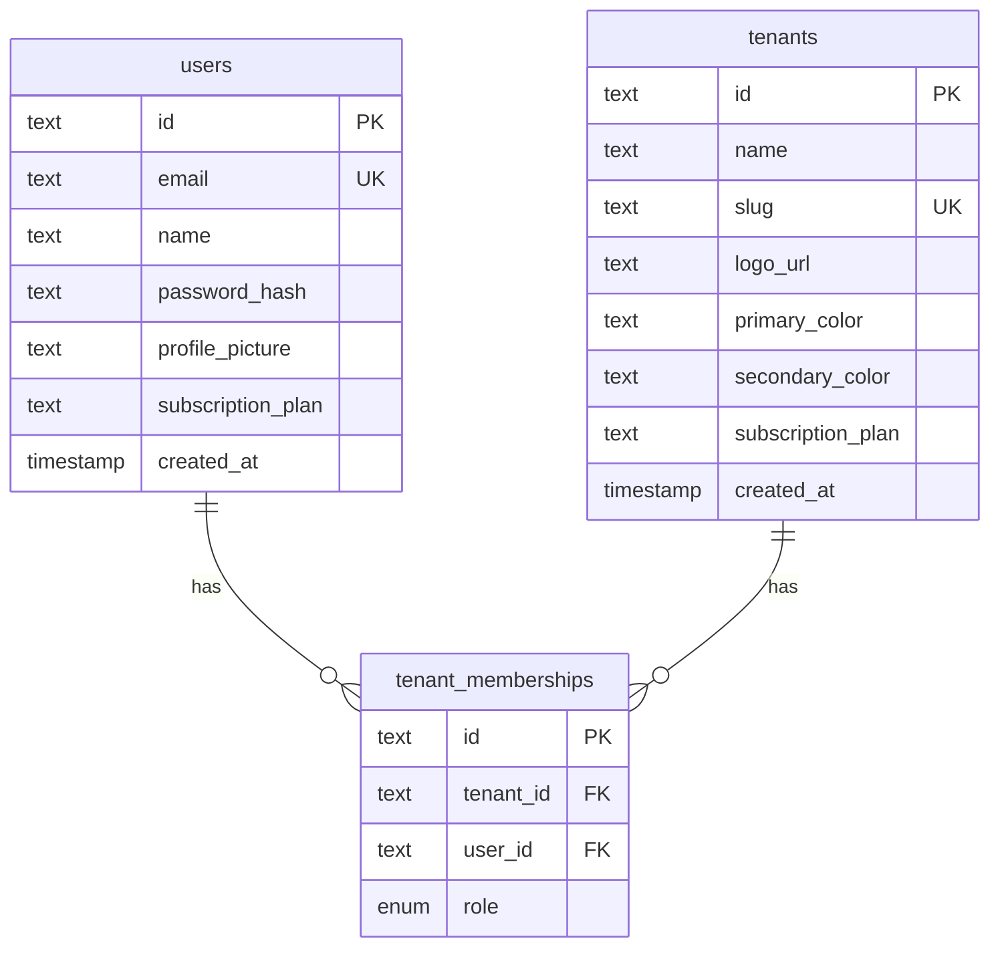

# Data Model

## Overview

This document defines the data model for a multi-tenant SaaS loyalty platform for local businesses (cafés, restaurants, etc.).

The system is built around strict tenant isolation and (target) event-driven loyalty interactions.

**How to read this document:**

- **[Implementation status](#implementation-status)** — what exists in the database today.
- **[Implemented schema (Fase 0)](#implemented-schema-fase-0)** — source of truth for current tables and fields.
- **[Target entities](#target-entities)** — loyalty, billing, and platform tables to add in later migrations.

**Related docs:** [`saas-architecture.md`](../saas-architecture.md), [`teenant-resolution.md`](../teenant-resolution.md) (how `tenant_id` reaches requests — JWT, not `users.tenant_id`), [`business-model.md`](../business-model.md), [`business-rules.md`](../business-rules.md). **Conventions:** [`not-null-fields.md`](not-null-fields.md), [`table-naming-singular-plural-convention.md`](table-naming-singular-plural-convention.md), [`text-over-varchar-char-convention.md`](text-over-varchar-char-convention.md). **Prisma:** [`prisma/schema.prisma`](../../prisma/schema.prisma), [`.agents/skills/prisma/`](../../.agents/skills/prisma/SKILL.md).

---

## Implementation status

| Area | In database today | Target (this doc) |
|------|-------------------|-------------------|
| `tenants`, `users`, `tenant_memberships` | **Yes** (Fase 0) | § Implemented |
| `customers` (QR en `qr_value`) | **Yes** | § 2.3–2.4 |
| `loyalty_transactions` | **Yes** | § 2.5 |
| `rewards`, `stamp_campaigns`, `customer_stamp_progress` | **Yes** | § 2.6–2.7 |
| `promotions`, `coupons`, `notifications` | **Yes** | § 2.8–2.10 |
| `subscription_plans`, `subscriptions`, tenant `status` / `features` / FK | **Yes** | § 2.1, billing |
| Superadmin tables | **No** | Future |

**Migrations (loyalty target):** `20260602120000_loyalty_customers` … `20260602120600_tenant_billing` (ver [`prisma/migrations/`](../../prisma/migrations/)).

**Repositories (Prisma, filtro `tenant_id`):** [`src/contexts/loyalty/`](../../src/contexts/loyalty/), [`PrismaTenantBillingRepository`](../../src/contexts/billing/subscriptions/infrastructure/PrismaTenantBillingRepository.ts).

**Conclusion:** do not add `tenant_id` to `users` — the implemented pattern is **global user + `tenant_memberships`**. New business data tables include `tenant_id` per §1.

---

## Implemented schema (Fase 0)

Applied migration: [`prisma/migrations/20260601193000_fidelization_foundation/migration.sql`](../../prisma/migrations/20260601193000_fidelization_foundation/migration.sql).



### Table `tenants` (`tenants`)

| Column | Type | Notes |
|--------|------|-------|
| `id` | UUID (text) | PK |
| `name` | text | Business display name |
| `slug` | text | Unique, URL-safe |
| `logo_url` | text | Default `''` |
| `primary_color` | text | Branding; runtime theme |
| `secondary_color` | text | Branding; runtime theme |
| `subscription_plan` | text | Default `'basic'` — string placeholder, not FK to plan catalog |
| `created_at` | timestamp | |

### Table `users` (`users`)

Platform identity. **No `tenant_id`** — tenant scope via `tenant_memberships`.

| Column | Type | Notes |
|--------|------|-------|
| `id` | UUID (text) | PK |
| `name` | text | |
| `email` | text | Unique platform-wide |
| `profile_picture` | text | Default `''` |
| `password_hash` | text | |
| `subscription_plan` | text | Starter: `FREE` \| `PREMIUM` ([`UserPlan`](../../src/contexts/identity/users/domain/UserPlan.ts)) — **not** tenant Basic/Pro/Premium |
| `created_at` | timestamp | |

### Table `tenant_memberships` (`tenant_memberships`)

| Column | Type | Notes |
|--------|------|-------|
| `id` | UUID (text) | PK |
| `tenant_id` | text | FK → `tenants` |
| `user_id` | text | FK → `users` |
| `role` | enum | `MembershipRole`: `owner` \| `employee` \| `customer` |

**Constraints:** unique `(tenant_id, user_id)`; cascade delete on tenant/user.

**Behaviour:**

- A user may belong to multiple tenants (one row per tenant).
- Session JWT carries active `tenantId` + `role` from the membership used at login.
- Owner onboarding creates `user` + `tenant` + membership `owner` in one transaction ([`PrismaOwnerOnboardingRepository`](../../src/contexts/tenants/owners/infrastructure/PrismaOwnerOnboardingRepository.ts)).

**Roles today:**

| Role | Status |
|------|--------|
| `owner` | Used (registration, demo seed) |
| `employee` | In schema; no operational flows yet |
| `customer` | In schema; reserved — see [Customer (target)](#23-customer-target) vs app login for end users |
| `admin` | **Not in schema** — future tenant-level admin if needed |

---

# 1. Core principle

## Tenant isolation rule

**Business data** (customers, transactions, promotions, coupons, etc.) must include `tenant_id` on every row. All queries must filter by tenant context.

**Platform users** (`users`) are global. Isolation is enforced through **`tenant_memberships`**, not a `tenant_id` column on `users`. Runtime tenant context in Fase 0 comes from the JWT `tenantId` claim after auth ([`teenant-resolution.md`](../teenant-resolution.md)).

**Platform-level data** (future superadmin, global `subscription_plans` catalog) has no `tenant_id`.

---

# Target entities

> **Migrated** (2026-06-02): tablas en [`prisma/schema.prisma`](../../prisma/schema.prisma) y migraciones `20260602120000_*` … `20260602120600_*`. Dominio/repos mínimos en `src/contexts/loyalty/` y `billing/subscriptions/`. Naming follows [table naming convention](table-naming-singular-plural-convention.md).

## 2.1 Tenant (target extensions)

Beyond Fase 0 columns, the target model may add:

| Field | Purpose |
|-------|---------|
| `status` | `active`, `suspended` |
| `subscription_plan_id` | FK → `subscription_plans` (replaces free string) |
| `features` | JSON feature flags (see §3) |
| `updated_at` | |
| `branding` (json) | Optional aggregate; today branding is explicit columns on `tenants` |

---

## 2.2 Platform user and membership (target)

**Implemented:** see [Implemented schema](#implemented-schema-fase-0). Do not model staff as `users.tenant_id` + `users.role`.

**Target notes:**

- Optional `is_active`, `last_login`, `updated_at` on `users`.
- Optional tenant role `admin` (distinct from platform superadmin).

---

## 2.3 Customer (target)

End users of the loyalty system (earn points, show QR). **Recommended:** dedicated `customers` table with `tenant_id`, aligned with [`business-rules.md`](../business-rules.md) (QR identifies customer; auditable scans).

| Field | Notes |
|-------|-------|
| `id` | PK |
| `tenant_id` | Required |
| `name` | |
| `email`, `phone` | Optional |
| `qr_code_id` | Link to QR identity (or embed `qr_value` here) |
| `points_balance`, `visits_count` | |
| `created_at`, `updated_at` | |

**Note on `MembershipRole.customer`:** enum value exists for a future flow where an end customer also has a `users` row and logs into the app. Product decision pending; loyalty balances should live on `customers`, not duplicate on `users`.

---

## 2.4 QR code identity (target)

| Field | Notes |
|-------|-------|
| `id`, `tenant_id`, `customer_id` | |
| `qr_value` | Unique token/string |
| `created_at` | |

---

## 2.5 Loyalty transaction (target)

| Field | Notes |
|-------|-------|
| `id`, `tenant_id`, `customer_id` | |
| `type` | `points_earned`, `points_redeemed`, `stamp_added`, `reward_redeemed`, `manual_adjustment` |
| `points` | Nullable |
| `metadata` | JSON |
| `created_by_user_id` | Nullable (staff user) |
| `created_at` | |

---

## 2.6 Reward (target)

| Field | Notes |
|-------|-------|
| `id`, `tenant_id`, `name`, `description` | |
| `cost_points`, `type` | `free_item`, `discount`, `custom` |
| `is_active`, `stock_limit`, `created_at` | |

---

## 2.7 Stamp campaign (target)

Example: buy 10 coffees → 1 free.

| Field | Notes |
|-------|-------|
| `id`, `tenant_id`, `name` | |
| `required_stamps`, `reward_id`, `is_active`, `created_at` | |

---

## 2.8 Customer stamp progress (target)

| Field | Notes |
|-------|-------|
| `id`, `tenant_id`, `customer_id`, `campaign_id` | |
| `current_stamps`, `completed`, `updated_at` | |

---

## 2.9 Promotion (target)

| Field | Notes |
|-------|-------|
| `id`, `tenant_id`, `title`, `description` | |
| `type` | `discount`, `bundle`, `seasonal` |
| `start_date`, `end_date`, `is_active` | |
| `conditions` | JSON |
| `created_at` | |

---

## 2.10 Coupon (target)

| Field | Notes |
|-------|-------|
| `id`, `tenant_id`, `code` | |
| `type` | `percentage`, `fixed`, `free_item` |
| `value`, `usage_limit`, `usage_count`, `expires_at`, `is_active`, `created_at` | |

---

## 2.11 Notification (target)

| Field | Notes |
|-------|-------|
| `id`, `tenant_id`, `title`, `message` | |
| `target_segment` | JSON |
| `sent_at`, `created_at` | |

---

## 2.12 Subscription plan (target)

Global catalog (no `tenant_id`). See [`business-model.md`](../business-model.md).

| Field | Notes |
|-------|-------|
| `id`, `name` | Basic / Pro / Premium |
| `price_monthly`, `price_yearly` | |
| `features`, `limits` | JSON |
| `is_active` | |

---

## 2.13 Subscription (target)

Per-tenant billing state.

| Field | Notes |
|-------|-------|
| `id`, `tenant_id`, `plan_id` | |
| `status` | `active`, `past_due`, `canceled` |
| `started_at`, `ends_at` | |
| `stripe_subscription_id` | Optional |
| `created_at` | |

---

# 3. Feature flag system (target)

Feature flags stored per tenant (column or JSON), enforced against plan catalog. **Not in schema today.**

Example structure:

```ts
features: {
  loyalty: true,
  promotions: true,
  gamification: false,
  referrals: true,
  coupons: true,
  analytics: true,
};
```

---

# 4. Event model (future extension)

Event tracking for analytics and automation (not implemented).

Suggested events: `customer.created`, `qr.scanned`, `points.earned`, `reward.redeemed`, `promotion.viewed`.

---

# 5. Relationships overview

**Implemented:**

* Tenant → TenantMemberships → Users
* User → many TenantMemberships → many Tenants

**Target (add when tables exist):**

* Tenant → Customers
* Tenant → Rewards, Promotions, Coupons, Notifications
* Customer → Loyalty transactions, Stamp progress
* Tenant → Subscription → Subscription plan

---

# 6. Scalability principles

* All business queries must be tenant-scoped (`tenant_id` or via membership context for auth).
* Avoid cross-tenant joins on business data.
* Index `tenant_id` on all future business tables.
* **Existing indexes:** `users.email`, `tenants.slug`, unique `(tenant_id, user_id)` on `tenant_memberships`.
* Prepare for horizontal scaling and event-based expansion (§4).

---

# 7. Future enhancements

* Row Level Security (PostgreSQL) — see [`saas-architecture.md`](../saas-architecture.md)
* Event sourcing for loyalty actions
* Real-time analytics pipeline
* Segmentation engine (customer groups)
* AI-driven promotion suggestions

---

# 8. Migration roadmap

Suggested order (aligned with MVP in [`AGENTS.md`](../../AGENTS.md)); each step = Prisma migration + domain context — not scheduled here.

1. `customers` + QR identity (or QR on `customers`)
2. `loyalty_transactions`
3. `stamp_campaigns` + `customer_stamp_progress`
4. `rewards`, `promotions`, `coupons`
5. `notifications`
6. `subscription_plans` + `subscriptions` + tenant `features` / plan FK
