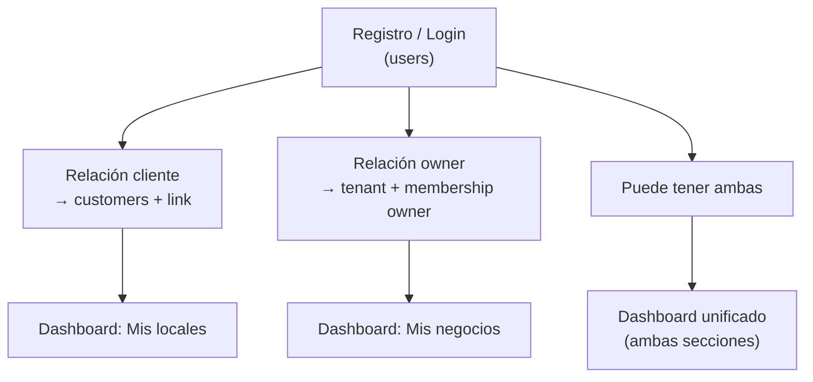

# Platform Mobile App — registro unificado y dashboards por relación

## Overview

Este documento define la **app móvil de plataforma** (Capacitor → App Store / Play Store): un único punto de entrada donde **owner y cliente se registran igual** (email/contraseña o Google), y el **dashboard** muestra negocios según la relación de cada usuario con ellos.

**Decisiones clave:**

1. **Un solo tipo de cuenta** (`users`) — no hay `ConsumerUser` separado del owner.
2. **Home de la app** — landing orientada a recompensas: **Empezar** (cliente) · **Registrar negocio** (secundario) · **Iniciar sesión** (siempre visible).
3. **Owner y cliente comparten auth** — «Registrar negocio» empieza por registrarse o iniciar sesión; el paso 2 es crear el perfil del negocio.
4. **Dashboard adaptativo** — el owner ve sus negocio(s); el cliente ve locales con los que tiene relación; puede explorar otros y ver solo sus promos activas hasta que interactúe.

**Relacionado:** [`business-onboarding.md`](business-onboarding.md) (wizard web owner actual), [`saas-architecture.md`](saas-architecture.md), [`post-onboarding-mvp-roadmap.md`](post-onboarding-mvp-roadmap.md), [`database/data-model.md`](../database/data-model.md), [`AGENTS.md`](../../AGENTS.md).

**Estado:** **Implemented** (2026-06-09) — Phase G [#38–#45](https://github.com/3urega/fidelization/issues/38): auth, dashboard, join, detalle local, QR global, Google OAuth, Capacitor deep links. Web legacy sin cambios.

---

## Problema de producto

Hoy:

- El **owner** se registra en web (`/register/business`) con un flujo dedicado.
- El **cliente** se registra sin cuenta en cada subdominio (`{slug}.domain/app`, solo nombre).
- No hay app unificada ni dashboard multi-establecimiento.

Objetivo:

- Una persona descarga **una app**.
- Se registra **una vez**.
- Según lo que haga después, actúa como cliente en cafés, como owner de su negocio, o **ambos** con la misma cuenta.

---

## Home de la app (pantalla pública)

Pantalla inicial antes de autenticación (`/` en app nativa o apex móvil). Vende recompensas (sellos, premios, locales), no el proceso de registro. Spec: [`rediseño-home.md`](../rediseño-home.md).

```
┌─────────────────────────────────┐
│            FIDELI               │
│  Tus cafés favoritos te         │
│         recompensan             │
│  [Hero visual: tarjeta/sellos]  │
│  ☕ Acumula sellos              │
│  🎁 Consigue premios            │
│  ❤️ Descubre nuevos locales     │
│   ┌─────────────────────────┐   │
│   │       Empezar           │   │  → flujo cliente
│   └─────────────────────────┘   │
│   ¿Ya tienes cuenta? Iniciar sesión
│   ── o continúa con Google ──   │
│   ¿Tienes un negocio?           │
│   ┌─────────────────────────┐   │
│   │   Registrar negocio     │   │  → flujo owner (secundario)
│   └─────────────────────────┘   │
└─────────────────────────────────┘
```

| Acción | Destino |
|--------|---------|
| **Empezar** | `/register` — formulario email/contraseña o Google → dashboard de **cliente** |
| **Registrar negocio** | `/business/register` — paso 1: registrarse o login → paso 2: crear negocio → dashboard de **owner** |
| **Iniciar sesión** | `/login` — email/contraseña o Google → dashboard según relaciones del usuario |

---

## Registro unificado (misma cuenta para todos)

Un único endpoint de identidad para personas (excluye superadmin):

| Método | Campos |
|--------|--------|
| Email + contraseña | `name`, `email`, `password` |
| Google OAuth | `name`, `email`, `oauthSubject` |

Resultado: fila en `users` **sin** `tenant_memberships` ni `customers` todavía. El rol efectivo lo define **con qué negocios se relaciona**, no un flag fijo en el registro.



**Importante:** la misma persona puede ser owner de *Café Sol* y cliente en *Panadería Luna* — un email, dos tipos de relación.

---

## Flujo A — Empezar (cliente)

1. Usuario pulsa **Empezar** en `/`.
2. Completa email/contraseña o **Continuar con Google**.
3. Sesión de plataforma (`userId`).
4. Llega al **dashboard cliente** (vacío al principio).
5. Descubre locales escaneando QR, buscando o enlaces → se crea relación cliente-tenant (ver § Relaciones).

No se pide «tipo de usuario» en el registro.

---

## Flujo B — Registrar negocio (owner)

1. Usuario pulsa **Registrar negocio**.
2. **Paso 1 — Identidad**
   - Si **no** tiene sesión: registrarse o iniciar sesión (mismos métodos que flujo A).
   - Si **ya** tiene sesión: continuar directamente.
3. **Paso 2 — Perfil del negocio**
   - Equivalente al Step 2 web actual (`/register/business/tenant`): nombre comercial, slug, etc.
   - Crea `tenants` + `tenant_memberships` (`role: owner`).
4. **Paso 3+ (post-MVP inmediato)** — plan, branding, etc. (reutilizar wizard web #13–#17 o versión app).
5. Llega al **dashboard owner** con ese negocio.

Un owner puede repetir «Añadir negocio» más adelante para un **segundo tenant** (multi-negocio).

---

## Flujo C — Login

1. Usuario pulsa **Iniciar sesión**.
2. Email/contraseña o Google.
3. Backend resuelve relaciones:
   - `tenant_memberships` donde `role = owner` (y opcionalmente `employee`)
   - `customers` vinculados vía `user_id`
4. Muestra **dashboard unificado** (ver siguiente sección).

---

## Dashboard post-login

Una sola pantalla home autenticada (`/home`) con **tres pestañas** (2026-06-11): **Explorar** (por defecto), **Mis locales**, **Mis negocios**. Header (saludo + email), botón «Mostrar mi QR» y cerrar sesión quedan fuera de las pestañas.

### Pestaña «Explorar» (todos los usuarios autenticados)

**Decisión de producto (2026-06-11):** al entrar en la app, el usuario debe poder **ver de forma visual todos los negocios activos** dados de alta en la plataforma, no solo los que ya tienen relación.

| Elemento | Contenido |
|----------|-----------|
| Ubicación | `/home` (pestaña por defecto) |
| Layout | Cuadrícula **2 columnas** en móvil; cada local es un recuadro clicable |
| Imagen | `tenants.logoUrl` como fondo **difuminado**; si no hay logo, placeholder genérico con inicial del nombre |
| Texto | Nombre del establecimiento **sobreimpreso** centrado sobre la imagen |
| Scroll | **Infinite scroll** — `GET /api/user/establishments?page=&limit=` devuelve páginas de tenants `status: active` ordenados por nombre |
| Tap | Abre detalle `/home/establishments/[slug]` (modo discovery o interaction según relación) |

Deep link legacy: `/home/discover` redirige a `/home?tab=locales`.

### Pestaña «Mis negocios» (owner / employee)

Visible si tiene `tenant_memberships` con rol owner (o employee con permisos operativos).

| Elemento | Contenido |
|----------|-----------|
| Lista | Negocios que posee o gestiona (logo, nombre, plan, estado) |
| Tap | Abre el panel del negocio directamente (`POST …/enter` → `/panel`) |
| CTA | «Añadir negocio» → flujo B paso 2 |

Un owner con **varios** negocios ve todos en esta sección. Los locales que ya son negocio propio **no** se duplican en «Mis locales».

### Pestaña «Mis locales» (cliente)

Visible si tiene al menos un `customers` vinculado a su `user_id` (excluyendo negocios propios).

| Elemento | Contenido |
|----------|-----------|
| Lista | Locales con **interacción** (visitas, sellos, puntos, canjes) |
| Resumen por fila | Nombre del local; progreso de sellos (`5/10 — Tarjeta verano`); `{pts} pts · {visitas} visitas` |
| Tap | Detalle del local (§ Vista detalle de un local) |
| CTA | Explorar locales (pestaña Explorar) o **Unirse por identificador** (formulario en la misma pestaña) |

**Interacción** = existe fila `customers` con historial (visitas > 0, sellos, puntos, canje, etc.) o join explícito previo. Locales solo «vistos» en modo descubrimiento no aparecen aquí hasta la primera interacción (decisión: opcional mostrar en «Recientes» sin historial — fase posterior).

### Usuario solo cliente / solo owner / ambos

| Perfil | Dashboard |
|--------|-----------|
| Solo registrado, sin relaciones | Empty state + CTAs «Escanea un local» / «Registrar negocio» |
| Solo cliente | Sección «Mis locales» |
| Solo owner | Sección «Mis negocios» |
| Owner + cliente | **Ambas secciones** en la misma home |

---

## Vista detalle de un local (cliente)

Ruta app: `/app/establishments/[slug]` (nombre orientativo).

Al entrar en un negocio, la UI depende de si el usuario **ha interactuado** con él:

### Con interacción previa

| Bloque | Contenido |
|--------|-----------|
| **Header** | Branding del tenant (logo, colores) |
| **Mi tarjeta** | QR de pago (único por usuario), puntos, progreso sellos, recompensas canjeables |
| **Promos de este local** | Promociones activas del tenant (respeta plan Pro+ del negocio) |
| **Otras promos activas** | Promos activas en **otros** locales donde el usuario también tiene relación — resumen lateral o sección inferior |
| **Historial** | Visitas recientes, canjes, sellos ganados (fase posterior si no MVP) |

### Sin interacción previa (descubrimiento)

El usuario abrió el local desde buscador, QR de escaparate o enlace, pero **aún no** tiene `customers` con actividad (o no existe perfil):

| Bloque | Contenido |
|--------|-----------|
| **Header** | Branding del tenant |
| **Promos activas** | Solo promociones activas **de este negocio** |
| **CTA** | «Unirme» / «Mostrar mi QR» — crea `customers` + link al `user_id` |

No se muestran puntos, sellos ni tarjetas propias hasta la primera interacción o join.

### QR de pago

- **Un QR por usuario** (en `users` o derivado), no por local.
- El empleado escanea en `{slug}.domain/scan`; el backend resuelve tenant desde la sesión staff + `userId`/`qrValue` del cliente.
- Si no hay perfil cliente en ese tenant: el **primer escaneo** crea la fila `customers` (auto-join) y registra la visita (+1 punto por defecto). El local aparece en «Mis locales» del dashboard. Join explícito (`POST /api/user/establishments/join`) sigue disponible para descubrir locales antes de visitar.

---

## Modelo de datos (target)

### Identidad — reutilizar `users`

| Campo nuevo / uso | Notas |
|-------------------|-------|
| `qr_value` UNIQUE | QR de pago global del usuario (nullable hasta first app login) |
| `oauth_provider`, `oauth_subject` | Google (Apple fase posterior) |
| Sin `role` fijo de cliente/owner en `users` | Rol por membership o customer |

### Relación owner — existente

`tenant_memberships(user_id, tenant_id, role)` — `owner` \| `employee`.

Un `user_id` puede tener **N memberships** owner (multi-negocio).

### Relación cliente — extender `customers`

| Campo | Notas |
|-------|-------|
| `user_id` | FK nullable → `users.id`; obligatorio para clientes app |
| `tenant_id` | Sin cambio |
| `points_balance`, sellos, etc. | Sin cambio — datos aislados por tenant |

Índice: `UNIQUE(user_id, tenant_id)` cuando `user_id` IS NOT NULL.

No hace falta tabla `tenant_customer_links` aparte si `customers.user_id` basta; el link **es** la fila customer.

### Sesión app (apex)

| Claim | Valor |
|-------|-------|
| `kind` | `user` (nuevo) o evolución de sesión sin tenant fijo |
| `userId` | PK de `users` |
| `qrValue` | opcional en token |

Al abrir panel **owner** de un negocio concreto, la app puede:

- usar ruta `/app/business/[slug]/admin` con verificación `tenant_memberships`, o
- emitir sub-sesión `kind: tenant` (como hoy) para APIs owner existentes.

Al abrir detalle **cliente** de un local: APIs loyalty scoped por `tenantId` + `customerId` resuelto desde `user_id`.

---

## Auth — evolución respecto al MVP

| Contexto | Hoy | Target app |
|----------|-----|------------|
| Superadmin | `kind: platform` | Sin cambio (web apex) |
| Owner/employee web | `kind: tenant` en subdominio | Sigue en web; app reutiliza o emite igual |
| Cliente web legacy | `kind: customer` en subdominio | Mantener `{slug}.domain/app` sin app |
| **App móvil** | — | `kind: user` en apex; relaciones en dashboard |

Registro app:

- `POST /api/auth/register` — unificado (sustituye `/register/business` solo en app; web puede redirigir).
- `POST /api/auth/login` — existente, extendido OAuth.
- `POST /api/auth/oauth/google` — callback Google.

Registrar negocio (tras auth):

- `POST /api/tenants` o reutilizar flujo onboarding #13 con sesión `user` en lugar de cookie onboarding.

---

## Rutas app (target)

| Ruta | Quién | Descripción |
|------|-------|-------------|
| `/` | Público | Home: Empezar · Registrar negocio · Iniciar sesión |
| `/register` | Público | Email/Google (flujo A) |
| `/login` | Público | Sesión existente |
| `/register/business` | Auth opcional | Paso 1 auth → paso 2 tenant (`/business/register/tenant`) |
| `/home` | Auth (`kind: user`) | Dashboard unificado (negocios + locales) |
| `/home/business/[slug]` | Owner | Entrada al panel del negocio |
| `/home/establishments/[slug]` | Cliente | Detalle local (interacción vs descubrimiento) |
| `/home/qr` | Cliente | QR de pago pantalla completa |
| `/join/[slug]` | Auth opcional | Deep link join a local |
| `/panel` | Auth (`kind: tenant`) | Panel del negocio (owner/employee web) |
| `/u/*` | — | Redirect 308 a rutas canónicas anteriores |

Web legacy (`(app)`, `(loyalty)`, `(auth)`) coexiste; la app nativa es el shell principal nuevo.

---

## Vertical slices (implementación)

| Slice | Valor | Capas |
|-------|-------|-------|
| **G1** | Home pública + registro/login unificado (email) | **Implemented** [#38](https://github.com/3urega/fidelization/issues/38) backend + [#39](https://github.com/3urega/fidelization/issues/39) UI apex sin `/u` (2026-06-09) |
| **G2** | «Registrar negocio» auth + crear tenant | **Implemented** [#40](https://github.com/3urega/fidelization/issues/40) (2026-06-09) — `/business/register`, `POST /api/user/businesses`, `ListUserRelationships` |
| **G3** | Dashboard unificado (mis negocios / mis locales) | **Implemented** [#41](https://github.com/3urega/fidelization/issues/41) (2026-06-09) — `/home`, `relationships` API, `/home/business/[slug]` |
| **Join** | Unirse a local (slug + deep link) | **Implemented** [#42](https://github.com/3urega/fidelization/issues/42) (2026-06-09) — `POST /api/user/establishments/join`, `/home/discover`, `/join/[slug]` |
| **G4** | Detalle local con interacción (tarjeta + promos) | **Implemented** [#43](https://github.com/3urega/fidelization/issues/43) (2026-06-09) — `/home/establishments/[slug]`, cross-promos, `/home/qr` |
| **G5** | Detalle local sin interacción (solo promos) | Promotions list pública por slug |
| **G6** | «Otras promos activas» en detalle | **Implemented** [#43](https://github.com/3urega/fidelization/issues/43) (2026-06-09) — `ListUserCrossTenantPromotions` |
| **G7** | QR global + scan staff | **Implemented** [#44](https://github.com/3urega/fidelization/issues/44) (2026-06-09), Phase M [#67](https://github.com/3urega/fidelization/issues/67) — `ResolveCustomerByQrForStaffScan` + `RecordStaffScanByTarget` |
| **G8** | Google OAuth + Capacitor | **Implemented** [#45](https://github.com/3urega/fidelization/issues/45) (2026-06-09) — GIS + `POST /api/auth/oauth/google`, `fidelization://join/{slug}`, `build:capacitor` |

**Dependencias:** Phase F (promociones owner CRUD) alimenta G5–G6 con datos reales.

---

## Relación con onboarding web actual

| Web hoy | App target |
|---------|------------|
| `/register/business` Step 1 | = Registrarse o login (mismo `users`) |
| `/register/business/tenant` Step 2 | = Paso 2 de «Registrar negocio» |
| Onboarding cookie `kind: onboarding` | Sustituible por sesión `kind: user` + flag `pendingTenant` o flujo en dos pantallas |
| Cliente `{slug}.domain/app` | Legacy web; migración gradual vía `user_id` en `customers` |

---

## Criterios de aceptación (target)

- [ ] Home app muestra Empezar, Registrar negocio e Iniciar sesión.
- [ ] Empezar (→ `/register`, email o Google) crea `users` y lleva al dashboard cliente.
- [ ] Registrar negocio exige auth (registro o login) y luego crea tenant + membership owner.
- [ ] Mismo email puede ser owner de N negocios y cliente en M locales.
- [ ] Dashboard owner lista sus negocios; dashboard cliente lista locales con interacción.
- [ ] Detalle local **con** interacción: tarjeta, promos del local, otras promos activas en otros locales.
- [ ] Detalle local **sin** interacción: solo promos activas de ese negocio.
- [x] Un QR de pago por usuario; scan staff atribuye al tenant correcto.
- [ ] Web legacy sigue operativa durante migración.

---

## Riesgos y mitigaciones

| Riesgo | Mitigación |
|--------|------------|
| Dos flujos de registro (web vs app) | Unificar API; web redirige a mismos endpoints |
| Sesión `kind: tenant` vs `kind: user` | App usa `user`; al entrar en admin negocio delega en APIs membership |
| Clientes MVP sin `user_id` | Perfiles huérfanos; claim por email en fase posterior |
| Promos cross-tenant en UI | Solo agregar promos de tenants donde existe `customers` para ese user |
| Confusión owner/cliente | Una home con secciones claras; no elegir rol al registrarse |

---

## Referencias en código (MVP actual)

- Owner registro: [`RegisterBusinessOwnerUser`](../../src/contexts/tenants/owners/application/register/RegisterBusinessOwnerUser.ts)
- Cliente registro: [`RegisterCustomer`](../../src/contexts/loyalty/customers/application/register/RegisterCustomer.ts)
- Sesiones: [`sessionClaims.ts`](../../src/lib/auth/sessionClaims.ts)
- Onboarding web: [`business-onboarding.md`](business-onboarding.md)

---

## Documentación a actualizar al implementar

| Archivo | Cambio |
|---------|--------|
| [`saas-architecture.md`](saas-architecture.md) | Sesión `kind: user`; dashboard unificado |
| [`business-onboarding.md`](business-onboarding.md) | Paridad app vs web Step 1–2 |
| [`database/data-model.md`](../database/data-model.md) | `users.qr_value`, `customers.user_id` |
| [`AGENTS.md`](../../AGENTS.md) | Rutas app, verify scripts |

---

## GitHub issues (Phase G — published)

| # | Título | Body file |
|---|--------|-----------|
| 38 | Platform app: unified user auth + session kind user (domain + API) | **Closed** (2026-06-09) — [issue #38](https://github.com/3urega/fidelization/issues/38) |
| 39 | Platform app: public home UI (Empezar / Registrar negocio / Iniciar sesión) | **Closed** (2026-06-09) — [issue #39](https://github.com/3urega/fidelization/issues/39); rediseño 2026-06 — [`rediseño-home.md`](../rediseño-home.md) |
| 40 | Platform app: register business flow (auth + create tenant) | **Closed** (2026-06-09) — [issue #40](https://github.com/3urega/fidelization/issues/40) |
| 41 | Platform app: unified dashboard (mis negocios + mis locales) | **Closed** (2026-06-09) — [issue #41](https://github.com/3urega/fidelization/issues/41) |
| 42 | Platform app: join establishment + customer user_id link | **Closed** (2026-06-09) — [issue #42](https://github.com/3urega/fidelization/issues/42) |
| 43 | Platform app: establishment detail (tarjeta, promos, descubrimiento) | **Closed** (2026-06-09) — [issue #43](https://github.com/3urega/fidelization/issues/43) |
| 44 | Platform app: global QR + staff scan lookup | **Closed** (2026-06-09) — [issue #44](https://github.com/3urega/fidelization/issues/44) |
| 45 | Platform app: Google OAuth + Capacitor + verify E2E | **Closed** (2026-06-09) — [issue #45](https://github.com/3urega/fidelization/issues/45) |

Manifest: [`docs/issues/manifest.platform-app.json`](../issues/manifest.platform-app.json)

---

## GitHub issues (Phase I — published)

| # | Slice | Título |
|---|-------|--------|
| [#46](https://github.com/3urega/fidelization/issues/46) | I1 | Discover establishments API — **Closed** (2026-06-11) |
| [#47](https://github.com/3urega/fidelization/issues/47) | I2 | Discover grid UI — **Closed** (2026-06-11) |
| [#48](https://github.com/3urega/fidelization/issues/48) | I3 | Home/discover integration — **Closed** (2026-06-11) |

Phase I issues: **todas cerradas** (#46–#48).

---

## GitHub issues (Phase S — perfil personal y zona de búsqueda)

Perfil `/home/profile` (información · tarjetas), zona de búsqueda persistida e integración con grid Explorar.

Spec: [`platform-user-profile-search-zone.md`](platform-user-profile-search-zone.md) · Manifest: [`docs/issues/manifest.phase-s-user-profile-search-zone.json`](../issues/manifest.phase-s-user-profile-search-zone.json)

