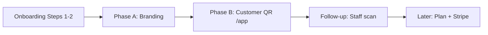

# Post-Onboarding MVP Roadmap

## Overview

This document defines the **next implementation phase** after business onboarding Steps 1–2 ([`business-onboarding.md`](business-onboarding.md) issues #11–#15).

**Decision:** defer onboarding **Step 3 (plan selection)** and **Step 4 (Stripe checkout)** until the owner can say: *“I already have customers with QR; now I choose a plan / pay.”*

**Focus instead:**

1. **Short branding** — owner configures visual identity (Step 5 partial).
2. **Customer QR `/app`** — end-customer loyalty entry on tenant subdomain (web-first).

Monetization and feature-flag enforcement remain documented in [`business-model.md`](business-model.md) and [`saas-architecture.md`](saas-architecture.md) as **target**; they are explicitly **out of scope** for this roadmap.

**Related:** [`AGENTS.md`](../../AGENTS.md) (MVP priorities, verify commands), [`teenant-resolution.md`](../teenant-resolution.md).

---

## Current state (baseline)

| Area | Status |
|------|--------|
| Owner registration + business wizard | Done — `verify:business-register`, `verify:business-onboarding` |
| Subdomain preview + prod cookie `Domain` | Done — `verify:format-tenant-host`, `verify:session-cookie-prod` |
| Owner `/home` | Shell only — placeholders in [`HomeDashboard.tsx`](../../src/app/(app)/home/HomeDashboard.tsx) |
| Tenant branding in DB | `logoUrl`, `primaryColor`, `secondaryColor` on `tenants`; defaults on create |
| Branding edit API + UI | Done (#16–#17, 2026-06-01) — `/settings/branding`, checklist `/home`, `verify:tenant-branding` |
| Customer loyalty | Done (#18–#20, 2026-06-05) — `/app`, APIs, `kind: customer`, `verify:customer-qr-session` |
| Session kinds | `platform`, `tenant`, `onboarding`, **`customer`** |
| Plan / Stripe (Steps 3–4) | Not implemented — intentional deferral |

---

## Roadmap sequence



| Phase | Doc reference | User-visible outcome |
|-------|---------------|----------------------|
| **A — Branding** | `business-onboarding.md` Step 5 (Branding) | Owner sets logo + colors; dashboard feels like their business |
| **B — Customer QR** ✅ | issues #18–#20 | Client opens `{slug}.domain/app`, gets loyalty card + QR |
| **Follow-up** | `AGENTS.md` MVP (QR scan) | Employee registers visit from scanned QR |
| **Later** | Steps 3–4 | Plan picker + trial/Stripe when product justifies payment |

---

## Phase A — Short branding

**Goal:** Complete the minimum of Step 5 so the owner reaches “my café” identity without a long wizard.

### Scope

| In | Out |
|----|-----|
| Edit `logoUrl`, `primaryColor`, `secondaryColor` | Loyalty model picker (points vs stamps) |
| Owner-only (`role: owner` or all staff — decide in VS1) | Image upload to storage (URL field OK for MVP) |
| Persist on `tenants` + live theme via `ThemeProvider` | Step 3 plan selection |
| Checklist item on `/home` (“Completa tu branding”) | Full Step 6 checklist (rewards, employees, etc.) |

### Vertical slices

| Slice | Value for the user | Layers / files |
|-------|-------------------|----------------|
| **A1** ✅ | Owner can save brand colors | **Implemented #16** (2026-06-01) — `UpdateTenantBranding`, `PATCH /api/tenant/branding`, owner-only |
| **A2** ✅ | UI: form on `/settings/branding` | **Implemented #17** (2026-06-01) — `TenantBrandingForm`, nav owner-only |
| **A3** ✅ | Dashboard reflects progress | **Implemented #17** — checklist en [`HomeDashboard.tsx`](../../src/app/(app)/home/HomeDashboard.tsx) |
| **A4** ✅ | Regression + docs | **Implemented #17** — `verify:tenant-branding`, `business-onboarding.md`, `AGENTS.md` |

### Acceptance criteria (Phase A)

- [x] Owner with tenant session can `PATCH` branding fields; persisted in Prisma. (#16)
- [x] `GET /api/me` (or branding GET) returns updated `tenant.logoUrl` / colors. (#16)
- [x] `ThemeProvider` / `TenantSessionProvider` reflect changes without full re-login. (#17)
- [x] `/home` shows branding as done or prompts to complete. (#17)
- [x] `verify:tenant-branding` passes (API + Prisma assertion). (#17)

### Suggested GitHub issues

- ~~**#16** — Update tenant branding (domain + API)~~ **Closed** (2026-06-01)
- ~~**#17** — Branding settings UI + home checklist~~ **Closed** (2026-06-01)

---

## Phase B — Customer QR `/app`

**Goal:** Third auth context (`kind: customer`): passwordless loyalty card on tenant subdomain.

**Entry URL:** `https://{slug}.{APP_DOMAIN}/app` (local: `http://cafe-demo.localhost:3000/app`).

**Status:** **Implemented** (issues #18–#20, 2026-06-05).

### Scope

| In | Out |
|----|-----|
| JWT `kind: customer` + `customerId` + `tenantId` | Employee scan → `LoyaltyTransaction` |
| Register customer: name (+ optional email/phone) | Stamps, rewards, promos UI |
| Server-generated unique `qrValue` | Push notifications |
| `/app/welcome`, `/app/card` (show QR + balance) | Capacitor build (reuse routes only) |
| Subdomain required; block `suspended` tenant | Staff `/login` changes |

### Vertical slices

| Slice | Value for the user | Layers / files |
|-------|-------------------|----------------|
| **B1** ✅ | Domain + session | **Implemented #18** (2026-06-05) — `CustomerSessionClaims`, `RegisterCustomer`, `qrValue` |
| **B2** ✅ | APIs | **Implemented #18** — loyalty register/auth/me + `requireCustomerSession` |
| **B3** ✅ | Routes + middleware | **Implemented #19** — `(loyalty)/app/`, middleware guards `/app/*` |
| **B4** ✅ | Card UI | **Implemented #19** — `/app/welcome`, `/app/card` + QR (`react-qr-code`) |
| **B5** ✅ | Verify + docs | **Implemented #20** (2026-06-05) — `verify:customer-qr-session`, `saas-architecture.md`, `AGENTS.md` |

### Acceptance criteria (Phase B)

- [x] New visitor on tenant host can register → `customers` row + unique `qrValue`. (#18)
- [x] Customer session cookie on **tenant subdomain** (host-only in dev; shared `Domain` in prod per [`session-cookies-localhost-dev.md`](../backend/session-cookies-localhost-dev.md)). (#18)
- [x] `/app/card` shows QR and points balance (0 for new customer). (#19)
- [x] Returning customer can re-auth (e.g. `qrValue` / stored session). (#18)
- [x] Suspended tenant cannot create customer session. (#18, #20 verify)
- [x] `verify:customer-qr-session` passes. (#20)

### Suggested GitHub issues

- ~~**#18** — Customer session + register customer (B1–B2)~~ **Closed** (2026-06-05)
- ~~**#19** — `/app` UI + middleware (B3–B4)~~ **Closed** (2026-06-05)
- ~~**#20** — verify + docs (B5)~~ **Closed** (2026-06-05)

---

## Follow-up (after Phase B)

**Status:** **Implemented** (2026-06-05).

| Item | Status |
|------|--------|
| **Owner link to `/app`** | ✅ Checklist en [`HomeDashboard.tsx`](../../src/app/(app)/home/HomeDashboard.tsx) + [`LoyaltyAppLinkCard`](../../src/app/_components/loyalty/LoyaltyAppLinkCard.tsx) |
| **Employee QR scan** | ✅ `POST /api/loyalty/scan`, [`/scan`](../../src/app/(app)/scan/page.tsx), `RecordCustomerVisitByQr`, `verify:customer-scan` |
| **Staff scan + stamps** | ✅ #22 (2026-06-09) — +1 sello por campaña activa, `stamp_added`, `verify:customer-stamp-scan` |
| **Customer stamp progress** | ✅ #23 (2026-06-09) — `GET /api/loyalty/me` + `stampProgress[]`, UI `/app/card`, `verify:customer-stamp-progress` |

---

## Phase C — Stamp campaigns (owner CRUD + customer progress)

**Status:** **Implemented** (#21–#23, 2026-06-09).

**Goal:** Owner configures stamp campaigns; staff scan adds stamps; customer sees progress on loyalty card.

| In | Out |
|----|-----|
| Owner CRUD API (`GET/POST/PATCH`) | Canje de recompensa |
| `/settings/stamps` + nav + `/home` checklist | Plan feature flags |
| Staff scan → +1 sello (#22) | Push al completar |
| Customer `stampProgress[]` + UI `/app/card` (#23) | Animaciones tarjeta física |
| `rewardId` null (premio en `name`) | |

### Acceptance criteria (Phase C)

- [x] Owner creates campaign with `name` + `requiredStamps` (#21)
- [x] Owner lists and deactivates campaigns without delete (#21)
- [x] `verify:stamp-campaigns-use-case` + `verify:stamp-campaigns` (#21)
- [x] Staff scan adds stamp per active campaign (#22)
- [x] Customer sees stamp progress on `/app/card` (#23)
- [x] `verify:customer-stamp-progress-use-case` + `verify:customer-stamp-progress` (#23)

---

## Phase D — Step 6: recompensas + equipo

**Status:** **Open** — [#24–#27](https://github.com/3urega/fidelization/issues/24) (2026-06-09).

**Goal:** Completar el checklist Step 6 de [`business-onboarding.md`](business-onboarding.md): *Create first reward* + *Invite employees*, alineado con prioridad MVP **recompensas** tras sellos (#21–#23).

| In | Out |
|----|-----|
| Owner CRUD recompensas (`costPoints`, activar/desactivar) | Puntos configurables por tenant (issue futura) |
| Cliente canjea recompensa en `/app/card` | Canje premio por sello completado |
| Owner invita empleado (user + membership `employee`) | Email magic-link / SSO |
| `/settings/team` + checklist «Invita empleado» | Plan feature flags |
| Empleado usa `/scan`; 403 en settings owner-only | Stripe / planes (Steps 3–4) |

### Vertical slices (draft issues)

| Slice | Valor para el usuario | Body file |
|-------|----------------------|-----------|
| **D1** | Owner crea catálogo de recompensas | ✅ #24 (2026-06-09) — `GET/POST/PATCH /api/loyalty/rewards`, `verify:rewards` |
| **D2** | Cliente canjea con puntos en `/app/card` | [`customer-reward-redeem.md`](../issues/customer-reward-redeem.md) |
| **D3** | Owner da de alta empleado (API) | [`tenant-employees-api.md`](../issues/tenant-employees-api.md) |
| **D4** | UI equipo + empleado escanea QR | [`tenant-employees-ui.md`](../issues/tenant-employees-ui.md) |

### Acceptance criteria (Phase D — target)

- [x] Owner CRUD rewards + `verify:rewards` (#24, 2026-06-09)
- [ ] Customer redeem + `verify:customer-reward-redeem` (#25 draft)
- [ ] Owner invite employee + employee login/scan (#26–#27 draft)
- [ ] `verify:tenant-employees` E2E

---

## Deferred — Steps 3–4 (plan + payment)

Trigger to start this work:

- Phase A + B shipped and verified.
- Owner dashboard can point to a working `/app` for their slug.
- At least one E2E path: owner branding → share link → customer card.

Then implement (separate plan / issues):

1. **Step 3** — Plan catalog (`subscription_plans`), wizard step or `/onboarding/plan`, `tenant.subscriptionPlan`, optional `status: trial`.
2. **Step 4** — Stripe Checkout + webhooks → `subscriptions` table; suspend on `past_due`.
3. **Feature flags** — Enforce plan limits per [`business-rules.md`](../business-rules.md).

---

## Risks and mitigations

| Risk | Mitigation |
|------|------------|
| Branding without file upload feels weak | Accept logo URL for MVP; document S3/CDN as follow-up |
| Customer session collides with staff JWT | Distinct `kind: customer`; separate `requireCustomerSession`; middleware route guards |
| `/app` on apex host | Require tenant subdomain (redirect or 404); align with [`resolveTenantFromRequest`](../../src/lib/tenant/resolveTenant.ts) |
| Local dev: customer cookie on `{slug}.localhost` | Document: open `/app` on tenant host, not bare `localhost` |
| Scope creep into stamps/rewards | Strict out-of-scope tables in Phase B issue |

---

## Verification matrix (target)

| Script | Phase |
|--------|-------|
| `verify:business-onboarding` | Baseline (existing) |
| `verify:tenant-branding` | A |
| `verify:customer-qr-session` | B |
| `verify:stamp-campaigns` | C (#21) |
| `verify:customer-stamp-scan` | C (#22) |
| `verify:customer-stamp-progress` | C (#23) |
| `verify:rewards` | D (#24) |
| `verify:customer-reward-redeem` | D (#25) |
| `verify:tenant-employees` | D (#26–#27) |
| `verify:session-cookie-prod` | B (prod cookie on tenant subdomain) |

---

## Success criteria (this roadmap)

A business owner who completed Steps 1–2 can:

1. Set logo and brand colors in under 2 minutes.
2. Open their subdomain link and see branding applied in the admin shell.
3. Share `{slug}.domain/app` so a customer gets a loyalty card with QR **without installing an app**.
4. Understand that plan selection and payment come **after** the loyalty entry point works.

---

## Documentation updates (when each phase ships)

| File | Update |
|------|--------|
| [`business-onboarding.md`](business-onboarding.md) | Step 5 branding partial (A); note Steps 3–4 deferred with link to this doc |
| [`saas-architecture.md`](saas-architecture.md) | Customer context + branding API status |
| [`AGENTS.md`](../../AGENTS.md) | Commands, routes, doc map row |
| This file | Mark phases **Implemented** with dates / issue numbers |

---

## GitHub issues (Phase A + B)

| # | Título | Body file |
|---|--------|-----------|
| 16 | Tenant branding — domain + API | **Closed** (2026-06-01) — [issue #16](https://github.com/3urega/fidelization/issues/16) |
| 17 | Tenant branding — settings UI + home checklist | **Closed** (2026-06-01) — [issue #17](https://github.com/3urega/fidelization/issues/17) |
| 18 | Customer session — register + loyalty APIs | **Closed** (2026-06-05) — [issue #18](https://github.com/3urega/fidelization/issues/18) |
| 19 | Customer loyalty app — `/app` UI + middleware | **Closed** (2026-06-05) — [issue #19](https://github.com/3urega/fidelization/issues/19) |
| 20 | Customer QR — verify E2E + docs | **Closed** (2026-06-05) — [issue #20](https://github.com/3urega/fidelization/issues/20) |
| 21 | Stamp campaigns — owner CRUD + API | **Closed** (2026-06-09) — [issue #21](https://github.com/3urega/fidelization/issues/21) |
| 22 | Staff scan — add stamp on active campaigns | **Closed** (2026-06-09) — [issue #22](https://github.com/3urega/fidelization/issues/22) |
| 23 | Customer card — stamp progress + verify E2E | **Closed** (2026-06-09) — [issue #23](https://github.com/3urega/fidelization/issues/23) |

## GitHub issues (Phase D)

| # | Título | Body file |
|---|--------|-----------|
| 24 | Rewards: owner CRUD + API | **Closed** (2026-06-09) — [issue #24](https://github.com/3urega/fidelization/issues/24) |
| 25 | Customer rewards: list + redeem + verify E2E | [`customer-reward-redeem.md`](../issues/customer-reward-redeem.md) — [issue #25](https://github.com/3urega/fidelization/issues/25) |
| 26 | Tenant team: invite employee + API | [`tenant-employees-api.md`](../issues/tenant-employees-api.md) — [issue #26](https://github.com/3urega/fidelization/issues/26) |
| 27 | Tenant team: settings UI + verify E2E | [`tenant-employees-ui.md`](../issues/tenant-employees-ui.md) — [issue #27](https://github.com/3urega/fidelization/issues/27) |

```bash
gh auth login
# Phase A–C (publicado)
powershell -File scripts/publish-github-issues.ps1 -Manifest docs/issues/manifest.post-onboarding.json
# Phase D Step 6 (draft)
powershell -File scripts/publish-github-issues.ps1 -Manifest docs/issues/manifest.step6.json
```

Skills: `plan-to-issues` (drafts) → `publish-github-issues` (GitHub) → `kanban-board` (close + cleanup `docs/issues/`). Ver [`docs/issues/README.md`](../issues/README.md).
