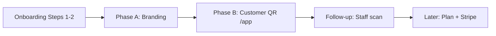

# Post-Onboarding MVP Roadmap

## Overview

This document defines the **next implementation phase** after business onboarding Steps 1–2 ([`business-onboarding.md`](business-onboarding.md) issues #11–#15).

**Decision:** defer onboarding **Step 3 (plan selection)** and **Step 4 (Stripe checkout)** until the owner can say: *“I already have customers with QR; now I choose a plan / pay.”*

**Focus instead:**

1. **Short branding** — owner configures visual identity (Step 5 partial).
2. **Customer QR `/app`** — end-customer loyalty entry on tenant subdomain (web-first).

Monetization and feature-flag enforcement remain documented in [`business-model.md`](business-model.md) and [`saas-architecture.md`](saas-architecture.md) as **target**; they are explicitly **out of scope** for this roadmap.

**Related:** [`docs/issues/customer-qr-session-web-first.md`](../issues/customer-qr-session-web-first.md) (issue draft), [`AGENTS.md`](../../AGENTS.md) (MVP priorities), [`teenant-resolution.md`](../teenant-resolution.md).

---

## Current state (baseline)

| Area | Status |
|------|--------|
| Owner registration + business wizard | Done — `verify:business-register`, `verify:business-onboarding` |
| Subdomain preview + prod cookie `Domain` | Done — `verify:format-tenant-host`, `verify:session-cookie-prod` |
| Owner `/home` | Shell only — placeholders in [`HomeDashboard.tsx`](../../src/app/(app)/home/HomeDashboard.tsx) |
| Tenant branding in DB | `logoUrl`, `primaryColor`, `secondaryColor` on `tenants`; defaults on create |
| Branding edit API | **No** — owner cannot persist branding after onboarding |
| Customer loyalty | Prisma + [`CustomerRepository`](../../src/contexts/loyalty/customers/domain/CustomerRepository.ts); **no UI/API/session** |
| Session kinds | `platform`, `tenant`, `onboarding` — **no `customer`** |
| Plan / Stripe (Steps 3–4) | Not implemented — intentional deferral |

---

## Roadmap sequence



| Phase | Doc reference | User-visible outcome |
|-------|---------------|----------------------|
| **A — Branding** | `business-onboarding.md` Step 5 (Branding) | Owner sets logo + colors; dashboard feels like their business |
| **B — Customer QR** | `customer-qr-session-web-first.md` | Client opens `{slug}.domain/app`, gets loyalty card + QR |
| **Follow-up** | `AGENTS.md` MVP (QR scan) | Employee registers visit from scanned QR |
| **Later** | Steps 3–4 | Plan picker + trial/Stripe when product justifies payment |

---

## Phase A — Short branding

**Goal:** Complete the minimum of Step 5 so the owner reaches “my café” identity without a long wizard.

### Scope

| In | Out |
|----|-----|
| Edit `logoUrl`, `primaryColor`, `secondaryColor` | Loyalty model picker (points vs stamps) |
| Owner-only (`role: owner` or all staff — decide in VS1) | Image upload to storage (URL field OK for MVP) |
| Persist on `tenants` + live theme via `ThemeProvider` | Step 3 plan selection |
| Checklist item on `/home` (“Completa tu branding”) | Full Step 6 checklist (rewards, employees, etc.) |

### Vertical slices

| Slice | Value for the user | Layers / files |
|-------|-------------------|----------------|
| **A1** | Owner can save brand colors | Domain: `UpdateTenantBranding` (or extend tenant use case); `PATCH /api/tenant/branding`; `requireTenantSession` + owner check |
| **A2** | UI: form on `/home` or `/settings/branding` | `(app)/settings/branding/page.tsx`, form reusing `Field`/`Input`, color inputs, logo URL |
| **A3** | Dashboard reflects progress | Replace one “Próximamente” card in [`HomeDashboard.tsx`](../../src/app/(app)/home/HomeDashboard.tsx) with checklist + link; sidebar logo from session after save |
| **A4** | Regression + docs | `npm run verify:tenant-branding`; note in `business-onboarding.md` Step 5 branding **partial**; `AGENTS.md` row |

### Acceptance criteria (Phase A)

- [ ] Owner with tenant session can `PATCH` branding fields; persisted in Prisma.
- [ ] `GET /api/me` (or branding GET) returns updated `tenant.logoUrl` / colors.
- [ ] `ThemeProvider` / `TenantSessionProvider` reflect changes without full re-login.
- [ ] `/home` shows branding as done or prompts to complete.
- [ ] `verify:tenant-branding` passes (API + optional Prisma assertion).

### Suggested GitHub issues

- **#16** — Update tenant branding (domain + API)
- **#17** — Branding settings UI + home checklist

---

## Phase B — Customer QR `/app`

**Goal:** Third auth context (`kind: customer`): passwordless loyalty card on tenant subdomain.

**Entry URL:** `https://{slug}.{APP_DOMAIN}/app` (local: `http://cafe-demo.localhost:3000/app`).

Full draft: [`docs/issues/customer-qr-session-web-first.md`](../issues/customer-qr-session-web-first.md).

### Scope

| In | Out |
|----|-----|
| JWT `kind: customer` + `customerId` + `tenantId` | Employee scan → `LoyaltyTransaction` |
| Register customer: name (+ optional email/phone) | Stamps, rewards, promos UI |
| Server-generated unique `qrValue` | Push notifications |
| `/app/welcome`, `/app/card` (show QR + balance) | Capacitor build (reuse routes only) |
| Subdomain required; block `suspended` tenant | Staff `/login` changes |

### Vertical slices

| Slice | Value for the user | Layers / files |
|-------|-------------------|----------------|
| **B1** | Domain + session | `CustomerSessionClaims` in [`sessionClaims.ts`](../../src/lib/auth/sessionClaims.ts); `createSessionToken` / middleware parse; `RegisterCustomer` + `qrValue` generation; reuse [`PrismaCustomerRepository`](../../src/contexts/loyalty/customers/infrastructure/PrismaCustomerRepository.ts) |
| **B2** | APIs | `POST /api/loyalty/customers/register`, `POST /api/loyalty/auth/qr` (returning), `GET /api/loyalty/me`; `requireCustomerSession` |
| **B3** | Routes + middleware | Route group `(loyalty)/app/`; middleware: `/app/*` needs resolved tenant; `/app/card` needs customer session; redirect staff/platform cookies appropriately |
| **B4** | Card UI | Mobile-first `/app/card`: name, `pointsBalance`, QR render from `qrValue` (SVG/lib); `/app/welcome` minimal signup |
| **B5** | Verify + docs | `npm run verify:customer-qr-session`; `saas-architecture.md` customer context **Yes**; `AGENTS.md` |

### Acceptance criteria (Phase B)

- [ ] New visitor on tenant host can register → `customers` row + unique `qrValue`.
- [ ] Customer session cookie on **tenant subdomain** (host-only in dev; shared `Domain` in prod per [`session-cookies-localhost-dev.md`](../backend/session-cookies-localhost-dev.md)).
- [ ] `/app/card` shows QR and points balance (0 for new customer).
- [ ] Returning customer can re-auth (e.g. `qrValue` / stored session).
- [ ] Suspended tenant cannot create customer session.
- [ ] `verify:customer-qr-session` passes.

### Suggested GitHub issues

- **#18** — Customer session + register customer (B1–B2)
- **#19** — `/app` UI + middleware (B3–B4)
- **#20** — verify + docs (B5)

---

## Follow-up (after Phase B)

Not part of this roadmap document’s implementation order, but the natural next tracer bullet:

| Item | Why next |
|------|----------|
| **Employee QR scan** | Closes loop: customer shows QR → staff records visit → points/stamps ([`business-rules.md`](../business-rules.md)) |
| **Owner link to `/app`** | `/home` checklist: “Comparte tu enlace de fidelización” using [`formatTenantHost`](../../src/lib/tenant/formatTenantHost.ts) |

---

## Deferred — Steps 3–4 (plan + payment)

Trigger to start this work:

- Phase A + B shipped and verified.
- Owner dashboard can point to a working `/app` for their slug.
- At least one E2E path: owner branding → share link → customer card.

Then implement (separate plan / issues):

1. **Step 3** — Plan catalog (`subscription_plans`), wizard step or `/onboarding/plan`, `tenant.subscriptionPlan`, optional `status: trial`.
2. **Step 4** — Stripe Checkout + webhooks → `subscriptions` table; suspend on `past_due`.
3. **Feature flags** — Enforce plan limits per [`business-rules.md`](../business-rules.md).

---

## Risks and mitigations

| Risk | Mitigation |
|------|------------|
| Branding without file upload feels weak | Accept logo URL for MVP; document S3/CDN as follow-up |
| Customer session collides with staff JWT | Distinct `kind: customer`; separate `requireCustomerSession`; middleware route guards |
| `/app` on apex host | Require tenant subdomain (redirect or 404); align with [`resolveTenantFromRequest`](../../src/lib/tenant/resolveTenant.ts) |
| Local dev: customer cookie on `{slug}.localhost` | Document: open `/app` on tenant host, not bare `localhost` |
| Scope creep into stamps/rewards | Strict out-of-scope tables in Phase B issue |

---

## Verification matrix (target)

| Script | Phase |
|--------|-------|
| `verify:business-onboarding` | Baseline (existing) |
| `verify:tenant-branding` | A |
| `verify:customer-qr-session` | B |
| `verify:session-cookie-prod` | B (prod cookie on tenant subdomain) |

---

## Success criteria (this roadmap)

A business owner who completed Steps 1–2 can:

1. Set logo and brand colors in under 2 minutes.
2. Open their subdomain link and see branding applied in the admin shell.
3. Share `{slug}.domain/app` so a customer gets a loyalty card with QR **without installing an app**.
4. Understand that plan selection and payment come **after** the loyalty entry point works.

---

## Documentation updates (when each phase ships)

| File | Update |
|------|--------|
| [`business-onboarding.md`](business-onboarding.md) | Step 5 branding partial (A); note Steps 3–4 deferred with link to this doc |
| [`saas-architecture.md`](saas-architecture.md) | Customer context + branding API status |
| [`AGENTS.md`](../../AGENTS.md) | Commands, routes, doc map row |
| This file | Mark phases **Implemented** with dates / issue numbers |

---

## GitHub issues (Phase A + B)

| # | Título | Body file |
|---|--------|-----------|
| 16 | Tenant branding — domain + API | [`docs/issues/16-tenant-branding-api.md`](../issues/16-tenant-branding-api.md) |
| 17 | Tenant branding — settings UI + home checklist | [`docs/issues/17-tenant-branding-ui.md`](../issues/17-tenant-branding-ui.md) |
| 18 | Customer session — register + loyalty APIs | [`docs/issues/18-customer-session-api.md`](../issues/18-customer-session-api.md) |
| 19 | Customer loyalty app — `/app` UI + middleware | [`docs/issues/19-customer-app-ui.md`](../issues/19-customer-app-ui.md) |
| 20 | Customer QR — verify E2E + docs | [`docs/issues/20-customer-qr-verify-docs.md`](../issues/20-customer-qr-verify-docs.md) |

```bash
gh auth login
# Windows (manifest — preferred)
powershell -File scripts/publish-github-issues.ps1 -Manifest docs/issues/manifest.post-onboarding.json
# macOS/Linux
bash scripts/publish-github-issues.sh docs/issues/manifest.post-onboarding.json
```

Skills: `plan-to-issues` (drafts) → `publish-github-issues` (GitHub) → `kanban-board` (close + cleanup `docs/issues/`). Ver [`docs/issues/README.md`](../issues/README.md).
