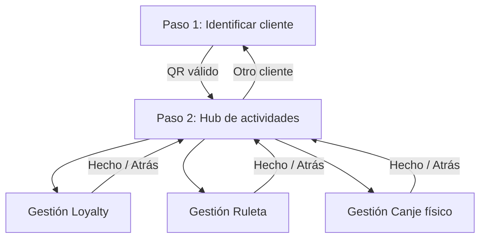

# Staff scan QR-first — Plan de implementación

**Status:** Draft (planning) — 2026-09-11  
**Reemplaza en espíritu (no en contrato API):** flujo UX de [`staff-scan-flow.md`](staff-scan-flow.md) § Target UX (target-first en una sola pantalla).  
**Relacionado:** [`roulette-game.md`](roulette-game.md) § Pantalla staff, [`post-onboarding-mvp-roadmap.md`](post-onboarding-mvp-roadmap.md), [`AGENTS.md`](../../AGENTS.md).

---

## Resumen ejecutivo

Reordenar `/scan` para alinearla con el flujo mental del mostrador:

1. **Identificar al cliente** (escanear o pegar QR primero).
2. **Elegir qué gestionar** (loyalty, ruleta, canje físico, … según lo que el tenant tenga activo y el estado del cliente).
3. **Una pantalla de gestión** por actividad, con **estado previo visible** (sellos 3/10, ruleta sin tiradas, promo agotada, premio físico pendiente, …) y acciones claras.

Los **writes** actuales (`POST /api/loyalty/scan`, redeem ruleta, etc.) pueden mantenerse en una primera fase; el cambio principal es un **read model staff** + **navegación en wizard** en el cliente.

---

## Evaluación del enfoque propuesto

### A favor

| Punto | Por qué encaja |
|-------|------------------|
| QR primero | En caja el cliente enseña el QR antes de explicar «quiero la ruleta» vs «un café de la tarjeta». |
| Hub de actividades | Separa **identidad** (quién es) de **intención** (qué hacemos ahora), en lugar de mezclar picker de catálogo + ruleta + canje en un formulario. |
| Estado antes de actuar | Evita autorizar ruleta a alguien ya agotado, o elegir una tarjeta completada sin contexto — hoy el picker muestra 0/N genérico. |
| Pantalla única por actividad | Mismo shell (`CustomerHeader`, volver al hub, «otro cliente») con paneles distintos — menos copy duplicado y menos campos QR repetidos. |

### Riesgos y cómo acotarlos

| Riesgo | Mitigación |
|--------|------------|
| Cliente pide **dos cosas** (sello + ruleta) | Hub con acciones independientes; tras completar una, volver al hub **sin** re-escanear (sesión staff en memoria/URL con `customerId` + TTL UX). |
| **Invariante** «un scan = un target» | Se mantiene en backend; la UI puede encadenar dos acciones guiadas, no un scan múltiple. |
| **Empleado** sin acceso a ficha cliente | Hoy `GetTenantCustomerDetail` es **owner-only**; el nuevo read model debe ser **staff** (owner + employee), datos mínimos para mostrador. |
| Sobrecarga de API en hub | Un agregado `GET …/session` en lugar de N llamadas sueltas desde el cliente. |
| Legacy ruleta (`unlockEnabled`) | Misma hub; actividad «Ruleta» muestra sub-modo legacy vs v2 según `scan-context`. |

### Qué no cambiar (fase 1)

- Contrato `POST /api/loyalty/scan` con `{ qrValue, targetType, targetId [, purchaseAmountEuros] }`.
- `ResolveCustomerByQrForStaffScan` (QR legacy tenant + QR global app + auto-join).
- Outcomes `StaffScanOutcome[]` y mensajes ES existentes.
- Canje físico: mismos endpoints `pending` + `redeem`; solo se **integra** como actividad del hub, no como `<details>` huérfano.

---

## Estado actual (baseline)

| Área | Implementación |
|------|----------------|
| Página | [`StaffScanPageClient.tsx`](../../src/app/(app)/scan/StaffScanPageClient.tsx) |
| Orden UX | Target picker → (importe ruleta) → QR → submit |
| Targets | [`ListStaffScanTargets`](../../src/contexts/loyalty/customers/application/scan/ListStaffScanTargets.ts) — catálogo tenant, **sin** progreso del cliente |
| Progreso sellos (por cliente) | [`GetCustomerStampProgress`](../../src/contexts/loyalty/customers/application/profile/GetCustomerStampProgress.ts) — usado en ficha owner, no en `/scan` |
| Ruleta participación | [`GetRouletteParticipationState`](../../src/contexts/loyalty/games/application/participation/GetRouletteParticipationState.ts) — app cliente; no expuesto a staff scan |
| Ficha cliente | [`GetTenantCustomerDetail`](../../src/contexts/loyalty/customers/application/analytics/GetTenantCustomerDetail.ts) — **owner-only**, demasiado pesada para empleado |
| Cámara QR | No implementada (MVP paste); plan compatible con añadir cámara solo en paso 1 |

---

## UX objetivo

### Flujo de alto nivel



### Paso 1 — Identificar cliente

- Entrada principal: QR (texto; luego cámara).
- Acción: **Continuar** → resuelve cliente (misma semántica que scan actual).
- Errores claros: QR desconocido, tenant suspendido, etc.
- **No** muta loyalty ni ruleta (solo resolución / auto-join).

### Paso 2 — Hub de actividades

Cabecera compacta del cliente: nombre, puntos, visitas (opcional avatar/iniciales).

Tarjetas de actividad (solo las disponibles):

| Actividad | Visible si | Badge de estado (ejemplos) |
|-----------|------------|----------------------------|
| **Tarjetas de sellos** | ≥1 campaña activa | «3/10 · siguiente sello», «Completada» |
| **Promociones** | plan Pro+ y promos activas | «2/3 usos», «Agotada» |
| **Ruleta** | juego activo + modo staff | «0 tiradas hoy», «Autorización pendiente», «No inscrito» |
| **Canje premio físico** | gamification + premios pending | «1 premio por entregar» |

Cada tarjeta muestra **si la acción tiene sentido ahora** (habilitada / deshabilitada con motivo), no solo un enlace.

CTA global: **Escanear otro cliente** (limpia sesión).

### Paso 3 — Pantalla de gestión (shell común)

Ruta sugerida (App Router):

- `/scan` — paso 1 (o redirect si hay sesión válida en cliente).
- `/scan/session` — hub paso 2.
- `/scan/session/loyalty` — sellos (+ promos o sub-rutas).
- `/scan/session/ruleta` — autorizar (v2) o visita+unlock (legacy).
- `/scan/session/redeem` — premios físicos pending.

**Shell compartido:** `StaffScanSessionLayout` — breadcrumb «Cliente › Ruleta», botón atrás al hub, resumen cliente sticky.

Contenido por actividad:

- **Loyalty (sellos):** lista de campañas con **progreso real** (`current/required`, `LoyaltyProgress`), sello deshabilitado si `completed`; CTA «Añadir sello» por campaña → confirma → `POST /api/loyalty/scan` con `stamp_campaign`.
- **Promociones:** lista con usos; CTA «Aplicar promoción» → `targetType: promotion`.
- **Ruleta v2:** panel con estado participación (`spinsRemainingToday`, `not_enrolled`, `pendingAuthorization`); campo importe; CTA autorizar → `roulette_authorize`. Mensajes alineados con `roulette_auth_denied` **antes** del submit cuando sea predecible (p. ej. cuota 0).
- **Ruleta legacy:** copy existente; CTA ligado a elegir tarjeta/promo en sub-vista loyalty o flujo dedicado «visita + unlock».
- **Canje:** lista `pendingSpins` + marcar canjeado (hoy en `StaffRoulettePendingRedeem`).

Tras mutación exitosa: toast + **actualizar read model** del hub (refetch session) + opción «Volver al hub».

---

## Backend — Read model staff

### Nuevo caso de uso (propuesto)

**`GetStaffScanSessionContext`** (nombre provisional)

| Input | `tenantId`, `role` (owner | employee), `qrValue` **o** `customerId` |
| Output | `StaffScanSessionView` |

**`StaffScanSessionView`** (campos orientativos):

```ts
// Dominio / aplicación — no contrato JSON final
{
  customer: { id, name, pointsBalance, visitsCount },
  tenantCapabilities: {
    stampCampaignsEnabled: boolean,
    promotionsEnabled: boolean,
    roulette: { authorizeEnabled, unlockEnabled, minPurchaseEuros } | null,
    physicalRedeemEnabled: boolean,
  },
  stampCards: Array<{
    campaignId, name, current, required, completed,
    visualTemplate, cardBackgroundVariant, stampTypeLabel, conditions,
    canAddStamp: boolean,
    blockReason?: "completed" | "campaign_inactive",
  }>,
  promotions: Array<{
    id, title, description, usedCount, maxUsesPerUser,
    canApply: boolean,
    blockReason?: "exhausted" | "inactive",
  }>,
  roulette: {
    participation: GetRouletteParticipationStateResult | null,
    pendingPhysicalCount: number,
  } | null,
}
```

**Implementación:** componer use cases existentes (no duplicar SQL):

- `ResolveCustomerByQrForStaffScan` (si viene QR).
- `GetCustomerStampProgress` + metadatos campaña de `ListStaffScanTargets` / repos.
- `ListCustomerPromotionSummaries` (filtrar activas).
- `GetRouletteParticipationState` + `ListPendingRouletteSpinsForStaff` (count o ids).
- Plan gates: mismos que `ListStaffScanTargets` / `AssertTenantPlanFeature`.

**Guard:** `StaffScanForbidden` para roles ≠ owner/employee (reutilizar patrón scan).

### API (propuesta)

| Método | Ruta | Notas |
|--------|------|-------|
| `GET` | `/api/loyalty/scan/session?qrValue=` | Paso 1→2 en una llamada tras QR |
| `GET` | `/api/loyalty/scan/session?customerId=` | Refetch hub tras acción (sin re-QR) |

Alternativa REST: `POST /api/loyalty/scan/identify { qrValue }` → `{ customerId, session… }` si se prefiere no loguear QR en query string.

**Deprecación UX (no API):** `GET /api/loyalty/scan/targets` pasa a alimentar solo settings/admin o se fusiona en session; la UI de `/scan` deja de depender del picker standalone.

### Resolver QR sin mutar (opcional slice)

Si se quiere separar lectura de auto-join explícito:

- Fase 1: identify vía session GET reutiliza `ResolveCustomerByQrForStaffScan` (auto-join igual que hoy).
- Fase 2 (opcional): auto-join solo al **primera acción** de loyalty; identify solo enlaza user existente — **decisión producto** (ver preguntas abiertas).

---

## Backend — Writes (sin cambios en fase 1)

| Acción UI | API actual |
|-----------|------------|
| Añadir sello | `POST /api/loyalty/scan` `stamp_campaign` |
| Aplicar promo | `POST /api/loyalty/scan` `promotion` |
| Autorizar ruleta | `POST /api/loyalty/scan` `roulette_authorize` + importe |
| Canjear premio | `POST …/spins/[id]/redeem` |

El session GET debe ser **coherente** con lo que el POST devolverá (mismas reglas de dominio).

---

## Frontend — Componentes (mapa)

| Componente | Responsabilidad |
|------------|-----------------|
| `StaffScanIdentifyStep` | QR + submit identify |
| `StaffScanActivityHub` | Tarjetas actividad + badges |
| `StaffScanSessionLayout` | Shell paso 3 + navegación |
| `StaffScanLoyaltyPanel` | Sellos/promos con progreso |
| `StaffScanRuletaPanel` | Estado + importe + autorizar |
| `StaffScanRedeemPanel` | Pending + redeem |
| `useStaffScanSession` | Fetch/cache session, invalidate tras POST |

Eliminar o reducir: `StaffScanForm` monolítico, `StaffScanTargetPicker` como primer paso, `<details>` suelto de redeem.

Estado de sesión:

- **Preferido:** `customerId` en URL `/scan/session?c=…` + refetch; QR no persistido en URL.
- **Memoria:** contexto React para evitar flash entre sub-rutas.

---

## Fases y vertical slices

Convención: **Phase Y** (staff scan QR-first). Publicar issues vía [`plan-to-issues`](../issues/README.md) cuando se apruebe este doc.

### Y1 — Dominio + API session (read)

| Entregable | Detalle |
|------------|---------|
| `StaffScanSessionView` + mapper JSON | [`src/contexts/loyalty/customers/domain/`](../../src/contexts/loyalty/customers/domain/) |
| `GetStaffScanSessionContext` | Composición + staff guard |
| Route delgada | [`thin-api-routes.md`](../backend/thin-api-routes.md) |
| Verify | `verify:staff-scan-session-use-case` |
| E2E | `verify:staff-scan-session` (owner + employee, QR platform auto-join) |

**Criterios:** respuesta incluye progreso 3/10 de verdad; ruleta muestra `spinsRemainingToday === 0` cuando corresponda; employee puede llamar API.

### Y2 — UI paso 1 + hub (paso 2)

| Entregable | Detalle |
|------------|---------|
| Rediseño `/scan` | Identify → hub |
| Badges actividad | Deshabilitar tarjetas con `blockReason` |
| Verify smoke | Actualizar `verify:staff-scan-roulette-ux` |

**Criterios:** flujo completo sin usar picker antiguo; «otro cliente» resetea.

### Y3 — Paneles de gestión (paso 3)

| Entregable | Detalle |
|------------|---------|
| Loyalty + promos | POST scan + refetch session |
| Ruleta v2 + legacy hints | Paridad con outcomes actuales |
| Canje físico | Integrado en ruta redeem |

**Criterios:** paridad funcional con Phase M + ruleta docs; un solo QR en paso 1.

### Y4 — Cámara QR (opcional)

| Entregable | Detalle |
|------------|---------|
| Capacitor / web API | Solo en identify step |
| Docs | Nota en [`staff-scan-flow.md`](staff-scan-flow.md) |

### Y5 — Cleanup + docs

| Entregable | Detalle |
|------------|---------|
| Retirar componentes muertos | Tras paridad verifies |
| Actualizar [`staff-scan-flow.md`](staff-scan-flow.md) | UX QR-first como target |
| `AGENTS.md` | Rutas / verifies Phase Y |

---

## Permisos y privacidad

| Rol | Hub session | Ficha `/customers/[id]` |
|-----|-------------|-------------------------|
| Owner | Sí — datos mostrador | Sí — analytics completo |
| Employee | Sí — **solo** campos session view | No (sin cambio salvo decisión explícita) |

No exponer en session: email/teléfono completos, historial largo, export — salvo que producto pida «ver ficha» enlace owner-only.

---

## Criterios de aceptación (global)

- [ ] Empleado identifica cliente por QR global app y ve progreso real de sellos antes de sumar sello.
- [ ] Hub muestra ruleta no disponible con motivo legible (no inscrito, sin tiradas, juego desactivado).
- [ ] Autorizar ruleta y registrar sello son acciones separadas desde el hub; cada una usa un POST scan único.
- [ ] Canje premio físico accesible desde hub con mismo comportamiento que hoy.
- [ ] Legacy `unlockEnabled` sigue funcionando con copy adecuado.
- [ ] Todos los `verify:staff-scan-*` y `verify:roulette-staff-*` relevantes pasan o se actualizan.

---

## Verifies (previstos)

```bash
npm run verify:staff-scan-session-use-case      # Y1 dominio
npm run verify:staff-scan-session               # Y1 E2E
npm run verify:staff-scan-record-by-target-use-case  # regresión writes
npm run verify:staff-scan-record-by-target
npm run verify:staff-scan-roulette-ux           # actualizar asserts HTML
npm run verify:roulette-staff-authorize
npm run verify:roulette-staff-redeem
```

---

## Preguntas abiertas (decidir antes de Y2)

1. **Auto-join:** ¿sigue en el primer GET session o solo al registrar primera visita?
2. **Promos + sellos:** ¿una actividad «Loyalty» o dos tarjetas en hub?
3. **Legacy ruleta:** ¿mantener botón «visita + unlock» separado o solo dentro de loyalty?
4. **Persistencia sesión:** ¿cuánto tiempo puede el empleado estar en hub sin re-identificar? (solo UX, sin JWT nuevo)
5. **Deep link:** ¿`/scan?qr=…` desde enlace futuro de cámara?

---

## GitHub issues (published 2026-09-11)

Manifest: [`manifest.phase-y-staff-scan-qr-first.json`](../issues/manifest.phase-y-staff-scan-qr-first.json)

| Slice | GitHub | Body file |
|-------|--------|-----------|
| Y1 | [#123](https://github.com/3urega/fidelization/issues/123) | [`staff-scan-session-domain-api.md`](../issues/staff-scan-session-domain-api.md) |
| Y2 | [#124](https://github.com/3urega/fidelization/issues/124) | [`staff-scan-identify-hub-ui.md`](../issues/staff-scan-identify-hub-ui.md) |
| Y3a | [#125](https://github.com/3urega/fidelization/issues/125) | [`staff-scan-session-loyalty-panels.md`](../issues/staff-scan-session-loyalty-panels.md) |
| Y3b | [#126](https://github.com/3urega/fidelization/issues/126) | [`staff-scan-session-ruleta-redeem-panels.md`](../issues/staff-scan-session-ruleta-redeem-panels.md) |
| Y4 | [#127](https://github.com/3urega/fidelization/issues/127) | [`staff-scan-qr-camera-identify.md`](../issues/staff-scan-qr-camera-identify.md) |
| Y5 | [#128](https://github.com/3urega/fidelization/issues/128) | [`staff-scan-qr-first-cleanup-docs.md`](../issues/staff-scan-qr-first-cleanup-docs.md) |

---

## Siguiente paso recomendado

1. Publicar issues (comando arriba) o implementar desde drafts en `docs/issues/`.
2. Implementar **Y1** antes de UI (contrato session estable).
3. Revisar preguntas abiertas durante Y2 si producto cambia defaults documentados en las issues.

---

## Changelog

| Fecha | Nota |
|-------|------|
| 2026-09-11 | Borrador inicial a partir de conversación UX administrador `/scan`. |
| 2026-09-11 | Batch Phase Y: 6 issues draft + manifest. |
