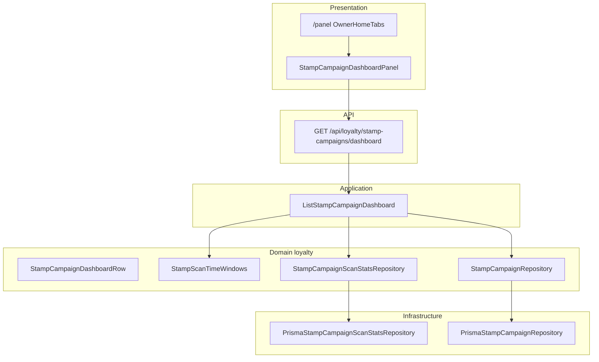

# Dashboard owner: métricas de escaneos por campaña de sellos

**Status:** **Implemented** — Phase K completo (#55–#58, 2026-06-11).

## Objetivo de producto

El **owner** del negocio debe ver de un vistazo en **`/panel`** (pestaña **Dashboard**):

- Qué **campañas de sellos activas** tiene.
- Cuántos **escaneos de sello** ha recibido cada campaña en:
  - **Hoy**
  - **Ayer**
  - **Última semana** (7 días naturales incluyendo hoy)
  - **Desde el inicio** de la campaña (`stamp_campaigns.created_at`)

El contenido actual del panel (checklist «Configuración inicial», enlace QR, placeholders) pasa a la pestaña **Configuración**.

Navegación entre pestañas: **clic** (desktop) y **clic + swipe horizontal** (mobile), con sincronización URL (`/panel?tab=dashboard|config`).

## Fuente de verdad (datos existentes)

Cada sello otorgado en escaneo genera una fila en `loyalty_transactions`:

- `type = stamp_added`
- `metadata.campaignId` — UUID de la campaña (escrito por [`RecordStaffScanByTarget`](../../src/contexts/loyalty/customers/application/scan/RecordStaffScanByTarget.ts))
- `created_at` — instante del escaneo

No hace falta nueva tabla de eventos; es un **read model** agregado sobre transacciones ya auditables.

Escaneos legacy sin `metadata.campaignId` no suman en ninguna campaña concreta (conteo 0).

## Arquitectura DDD (onion)



### Capa dominio (`loyalty/stamp_campaigns`)

| Artefacto | Responsabilidad |
|-----------|-----------------|
| `StampCampaignScanCounts` | VO: `{ today, yesterday, last7Days, sinceStart }` |
| `StampCampaignDashboardRow` | Read model: campaña + tipo + sellos requeridos + contadores |
| `StampScanTimeWindows` | Servicio puro: límites `[start, end)` por ventana dado `referenceDate` + timezone |
| `StampCampaignScanStatsRepository` | Puerto: agregar conteos por `campaignId` y ventanas |
| `ListStampCampaignDashboard` | Caso de uso: listar campañas **activas** + rellenar contadores |

**Reglas:**

- Solo tenant de la sesión (`tenantId` del JWT).
- Solo rol **owner** (empleado no ve pestaña Dashboard ni API).
- Ventanas calendario en timezone configurable (`APP_TIMEZONE`, default `Europe/Madrid`; fallback UTC si no está definido).
- `sinceStart`: `[campaign.createdAt, referenceDate)` — no incluye escaneos anteriores a la creación de la campaña aunque existieran transacciones huérfanas.
- `last7Days`: desde inicio del día `(referenceDate - 6 días)` hasta fin del día `referenceDate`.

### Capa infraestructura

`PrismaStampCampaignScanStatsRepository`:

- Una consulta agregada por tenant (evitar N+1):
  - `WHERE tenant_id = ? AND type = 'stamp_added'`
  - `AND metadata->>'campaignId' IN (...)`
  - `COUNT(*) FILTER (WHERE created_at >= ? AND created_at < ?)` por ventana
- Índice recomendado: `(tenant_id, type, created_at)` en `loyalty_transactions` (migración opcional en K1).

Reutilizar `StampCampaignRepository.listByTenant` o método `listActiveByTenant` existente.

### Capa API

`GET /api/loyalty/stamp-campaigns/dashboard`

- Sesión tenant, guard owner.
- Respuesta JSON estable para UI y verifies.

```json
{
  "campaigns": [
    {
      "id": "uuid",
      "name": "10 cafés gratis",
      "stampTypeLabel": "Café",
      "requiredStamps": 10,
      "createdAt": "2026-06-01T10:00:00.000Z",
      "scans": {
        "today": 3,
        "yesterday": 5,
        "last7Days": 21,
        "sinceStart": 42
      }
    }
  ],
  "generatedAt": "2026-06-11T12:00:00.000Z",
  "timezone": "Europe/Madrid"
}
```

### Capa presentación

| Componente | Ubicación | Notas |
|------------|-----------|-------|
| `OwnerHomeTabs` | [`OwnerHomeTabs.tsx`](../../src/app/(app)/panel/OwnerHomeTabs.tsx) | Tabs Dashboard · Configuración; swipe mobile — **Implemented #57** (2026-06-11) |
| `OwnerConfigurationPanel` | [`OwnerConfigurationPanel.tsx`](../../src/app/(app)/panel/OwnerConfigurationPanel.tsx) | Contenido tab Configuración — **Implemented #57** |
| `StampCampaignDashboardPanel` | [`StampCampaignDashboardPanel.tsx`](../../src/app/_components/loyalty/StampCampaignDashboardPanel.tsx) | Fetch API + tarjetas por campaña — **Implemented #58** (2026-06-11) |
| `useSwipeableTabs` | [`useSwipeableTabs.ts`](../../src/app/_components/shell/useSwipeableTabs.ts) | Reutilizable; umbral ~50px horizontal — **Implemented #57** |

Patrón de referencia: pestañas en [`PlatformUserDashboard`](../../src/app/(mobile)/home/PlatformUserDashboard.tsx) (`?tab=` + `role="tablist"`).

## Vertical slices (Phase K)

| Slice | Valor | Verify |
|-------|-------|--------|
| **K1** | Dominio + repo agregación + ventanas temporales | `verify:stamp-campaign-dashboard-use-case` |
| **K2** | API owner + JSON + E2E con escaneos reales | `verify:stamp-campaign-dashboard` |
| **K3** | `/panel` tabs + swipe + mover checklist a Configuración | Manual + regresión `verify:owner-login` — **Implemented #57** (2026-06-11) |
| **K4** | UI métricas (tarjetas, empty state, link a `/settings/stamps`) | `verify:stamp-campaign-dashboard` + `verify:owner-login` — **Implemented #58** (2026-06-11) |

## Fuera de alcance (Phase K)

- Analítica de puntos, visitas totales o promociones.
- Gráficos históricos / export CSV.
- Timezone por tenant en perfil (fase posterior).
- Dashboard para empleados.
- Campañas inactivas en el listado (solo activas).

## GitHub issues (published)

| # | Slice | Título |
|---|-------|--------|
| [#55](https://github.com/3urega/fidelization/issues/55) | K1 | Domain + aggregation repository | **Closed** (2026-06-13) |
| [#56](https://github.com/3urega/fidelization/issues/56) | K2 | API + verify E2E | **Closed** (2026-06-13) |
| [#57](https://github.com/3urega/fidelization/issues/57) | K3 | `/panel` tabs + swipe | **Closed** (2026-06-11) |
| [#58](https://github.com/3urega/fidelization/issues/58) | K4 | Dashboard UI | **Closed** (2026-06-11) |

Publicado 2026-06-11 — issues #55–#58 (Phase K).

## Referencias

- [`business-rules.md`](business-rules.md) — sellos y QR auditable
- [`post-onboarding-mvp-roadmap.md`](post-onboarding-mvp-roadmap.md) — Phase K
- Issue #21 stamp campaigns, Phase H sellos tipados
