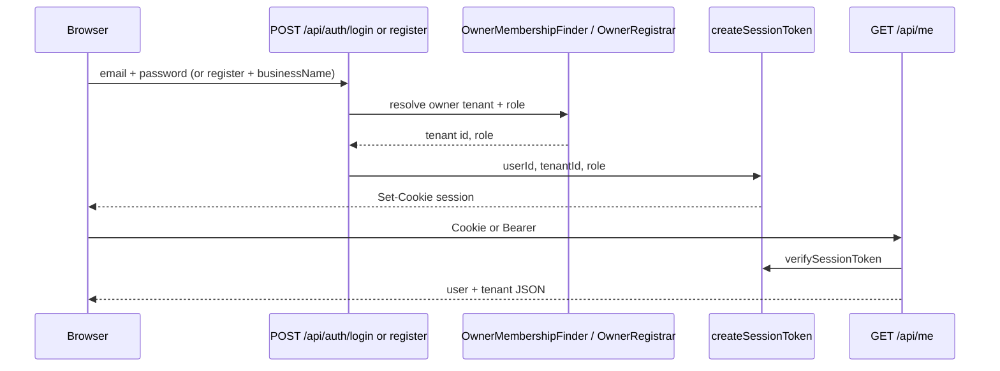

# Tenant Resolution

> **Filename note:** this file is named `teenant-resolution.md` (typo: *teenant*). Prefer linking to this path until a rename is requested; a future rename would be `tenant-resolution.md`.

## Overview

This document defines how the system **should** identify, load, and enforce tenant context in a multi-tenant SaaS architecture, and what is **implemented today** in the starter (Fase 0).

Tenant resolution is critical because it underpins:

* Data isolation between businesses
* Correct branding and configuration loading
* Feature flag enforcement per tenant (target)
* Secure access control

**How to read this document:**

* **[Implementation status](#implementation-status-current-repo)** — what runs in the repo now (JWT session, memberships, middleware).
* **Sections 1–13 below** — mostly **target specification** (subdomain routing, middleware tenant load, caching, white-label). Do not assume they are live until listed as implemented in the status table.

**Related docs:** [`saas-architecture.md`](saas-architecture.md), [`database/data-model.md`](database/data-model.md) (no `users.tenant_id`; use `tenant_memberships`), [`AGENTS.md`](../AGENTS.md). **Code:** [`src/middleware.ts`](../src/middleware.ts), [`src/lib/auth/session.ts`](../src/lib/auth/session.ts), [`src/lib/auth/middlewareSession.ts`](../src/lib/auth/middlewareSession.ts).

---

## Implementation status (current repo)

| Area in this doc | Target | Implemented now | Notes |
|------------------|--------|-----------------|-------|
| Subdomain → tenant slug | `{slug}.domain.com` resolves tenant | **No** | Single origin (`localhost` / app host); `tenants.slug` exists for future routing |
| Middleware tenant resolution | Parse host, load tenant, inject context | **No** | [`src/middleware.ts`](../src/middleware.ts): session cookie check for page redirects + CORS on `/api/*` only |
| Tenant context in requests | Every request has resolved tenant | **Partial** | After login: JWT claims `tenantId` + `role`; APIs use [`getAuthenticatedSession`](../src/lib/auth/session.ts) |
| User ↔ tenant data model | Scoped users | **Partial** | **Global `users`** + **`tenant_memberships`** — **not** `users.tenant_id` ([`data-model.md`](database/data-model.md)) |
| Login / register tenant scope | Tenant from subdomain | **Partial** | No hostname tenant; login picks **owner** membership; register creates tenant + membership |
| Session `tenantId` | Embedded in session | **Yes** | HS256 JWT in `session` cookie; same claims verified in Edge ([`middlewareSession.ts`](../src/lib/auth/middlewareSession.ts)) |
| Branding per tenant | Theme from tenant record | **Partial** | DB: `primaryColor`, `secondaryColor`, `logoUrl`; UI via `ThemeProvider` after auth response |
| `x-tenant-id` header fallback | Optional explicit tenant | **No** | Not used |
| React `TenantContext` / `[tenant]` route | Global tenant provider | **No** | Flat `src/app/` routes; tenant from `/api/me` and auth JSON |
| Tenant lookup cache (Redis) | Per-request cache | **No** | Direct Prisma on auth flows |
| Custom domains / white-label | DNS + domain table | **No** | Spec only (§1) |
| Disabled / unknown tenant pages | 404 / billing expired | **No** | Not in middleware |

**Conclusion:** Fase 0 resolves tenant **after authentication** via JWT `tenantId` (and owner onboarding at register). Subdomain middleware, request-level tenant injection, and header overrides are **not** implemented. When adding business tables or APIs, scope by `tenant_id` on domain rows and validate `session.tenantId` — never add `tenant_id` to `users`.

### Implemented flow (Fase 0)



**Register:** [`POST /api/auth/register`](../src/app/api/auth/register/route.ts) → `OwnerRegistrar` creates `User`, `Tenant` (slug from `businessName` via [`slugifyBusinessName`](../src/contexts/tenants/owners/infrastructure/slugifyBusinessName.ts)), `TenantMembership` role `owner`, then session with `tenantId`.

**Login:** [`POST /api/auth/login`](../src/app/api/auth/login/route.ts) → `UserAuthenticator` + `OwnerMembershipFinder` (first `tenant_memberships` row with `role = owner` for that user). No subdomain or slug in request.

**Middleware:** [`src/middleware.ts`](../src/middleware.ts) does **not** read `Host` or `tenants.slug`. It redirects unauthenticated users away from `/home` and authenticated users away from `/login`, `/register`, `/`.

---

# 1. Tenant Resolution Strategy (target)

The platform **target** uses **subdomain-based tenant resolution** as the primary mechanism.

## Primary strategy: subdomain routing

Each tenant is accessed via a unique subdomain:

```
{tenant-slug}.domain.com
```

### Example

```
cafe-joan.app.com
```

(`tenants.slug` in the database maps to this subdomain label.)

### Flow (target)

1. User visits URL
2. System extracts subdomain from hostname
3. Subdomain is mapped to `tenants.slug`
4. Tenant is loaded into application context

---

## Future strategy: custom domains (white-label)

Tenants may later use their own domains:

```
loyalty.cafe-joan.com
```

or:

```
cafe-joan.com
```

### Requirements (target)

* Domain mapping table
* DNS verification
* SSL automation (e.g. Let's Encrypt)

---

# 2. Tenant context resolution flow (target)

1. Incoming request is received
2. Middleware extracts hostname
3. System parses tenant identifier (subdomain or custom domain)
4. Tenant is fetched from the database
5. Tenant context is injected into the request lifecycle
6. Application renders using tenant config

**Today:** steps 2–5 are replaced by JWT verification and `session.tenantId` on protected API routes; pages do not receive middleware-injected tenant.

---

# 3. Middleware layer (target vs today)

**Target:** a global middleware resolves tenant context from the host.

### Target responsibilities

* Extract hostname
* Identify tenant slug
* Load tenant data
* Attach tenant to request context
* Reject invalid or disabled tenants

### Conceptual example (target)

```ts
function resolveTenant(request: Request) {
  const hostname = request.headers.get("host") ?? "";
  const tenantSlug = extractSubdomain(hostname);

  const tenant = await db.tenant.findUnique({ where: { slug: tenantSlug } });

  if (!tenant) {
    throw new Error("Tenant not found");
  }

  return tenant;
}
```

**Implemented middleware** ([`src/middleware.ts`](../src/middleware.ts)): session presence for selected pages; CORS for `/api/*`. No `resolveTenant`.

---

# 4. Tenant context injection (target)

Once resolved, tenant data should be available across the app.

## Frontend (Next.js) — target

* Server components
* API routes
* Client context (React Context or store)

### Example shape (target)

```ts
type TenantContext = {
  id: string;
  name: string;
  branding: object;
  features: object;
};
```

**Today:** tenant JSON returned from auth and [`GET /api/me`](../src/app/api/me/route.ts); theme colors applied in login/register forms and `ThemeProvider`. No shared server `TenantContext` provider.

---

# 5. Authentication and tenant scope

Authentication must always be scoped to a tenant for business operations.

### Data model (implemented)

* **`users`** are global (email unique platform-wide). **Do not** add `users.tenant_id`.
* **Staff and customers (target)** link to tenants via **`tenant_memberships`** (`tenant_id`, `user_id`, `role`). A user may have multiple memberships in the schema; Fase 0 login/register only supports the **owner** path.
* **Customers (target)** will typically use a dedicated `customers` table with `tenant_id` ([`data-model.md`](database/data-model.md)).

### Session (implemented)

JWT claims ([`SessionClaims`](../src/lib/auth/session.ts)): `userId` (sub), `tenantId`, `role`. Cookie name: `session`. Optional `Authorization: Bearer` on API routes.

### Login flow

| Step | Target | Fase 0 |
|------|--------|--------|
| 1 | User accesses tenant subdomain | Single app URL |
| 2 | Auth includes tenant from host | Email + password only |
| 3 | Validate credentials in tenant scope | Global user + owner membership |
| 4 | Session with tenant id | JWT `tenantId` from membership — **not** a column on `users` |

Cross-tenant auth must remain forbidden: APIs should treat `session.tenantId` as authoritative and verify membership when multiple roles exist.

---

# 6. Security rules

## Hard isolation rules

* Every **business** query must filter by `tenant_id` (or equivalent tenant context).
* Do not rely on a missing tenant filter.
* **Target:** middleware enforces tenant presence on each request; **today:** enforce in API handlers via session + membership checks.
* **Target:** optional PostgreSQL RLS ([`saas-architecture.md`](saas-architecture.md)).

## Forbidden

* Cross-tenant data access
* Trusting client-supplied `tenantId` without session/membership validation
* Adding `tenant_id` to `users` (use `tenant_memberships`)

---

# 7. API design pattern

All backend requests should assume tenant context.

## Option A: implicit via middleware (target, recommended)

Tenant resolved from domain/subdomain before handlers run.

## Option B: explicit header (target, fallback only)

```ts
headers: {
  "x-tenant-id": "abc123"
}
```

**Fase 0:** use **session JWT** (`tenantId` claim) via cookie or Bearer — not `x-tenant-id`.

---

# 8. Frontend routing strategy (Next.js)

## Target: App Router with subdomain middleware

Flat routes under `app/` (no `[tenant]` segment) when tenant is resolved at middleware.

## Alternative (target): dynamic segment

```
app/
  [tenant]/
    dashboard/
    customers/
    rewards/
```

**Implemented:** flat [`src/app/`](../src/app/) (`/`, `/login`, `/register`, `/home`); tenant from session/API, not from route param.

---

# 9. Tenant branding injection

**Target flow:** resolve tenant → fetch branding → apply theme → render.

**Partial today:** tenant colors in DB; [`ThemeProvider`](../src/app/_components/theme/ThemeProvider.tsx) and auth responses set CSS variables from tenant primitives.

---

# 10. Failure states (target)

| State | Target behavior | Fase 0 |
|-------|-----------------|--------|
| Unknown tenant (bad subdomain) | 404 or marketing redirect | N/A (no subdomain resolution) |
| Disabled tenant | Subscription expired page | Not implemented |
| Misconfigured custom domain | Configuration error page | Not implemented |

---

# 11. Performance considerations (target)

* Cache tenant lookup (e.g. Redis)
* Avoid repeated DB queries per request
* Store tenant context in request lifecycle
* Preload branding in server layer when possible

---

# 12. Future enhancements

* Subdomain (or edge) middleware tenant resolution
* Geo-based tenant routing (marketing)
* Multi-tenant session / agency mode (switch tenant for admins)
* Custom domains and white-label
* Align login with hostname tenant + membership picker when a user has multiple tenants

---

# 13. Summary

Tenant resolution is the foundation of isolation, security, branding, and feature consistency.

**Target:** hostname → tenant → request context → queries scoped by `tenant_id`.

**Fase 0:** register/login → `tenant_memberships` → JWT `tenantId` → APIs and UI load tenant by session. Subdomain middleware and `users.tenant_id` are **out of scope** for the current implementation.
