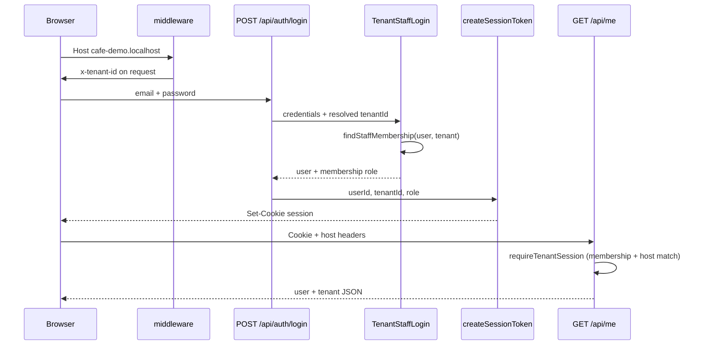

# Tenant Resolution

> **Filename note:** this file is named `teenant-resolution.md` (typo: *teenant*). Prefer linking to this path until a rename is requested; a future rename would be `tenant-resolution.md`.

## Overview

This document defines how the system **should** identify, load, and enforce tenant context in a multi-tenant SaaS architecture, and what is **implemented today** in the starter (Fase 0).

Tenant resolution is critical because it underpins:

* Data isolation between businesses
* Correct branding and configuration loading
* Feature flag enforcement per tenant (target)
* Secure access control

**How to read this document:**

* **[Implementation status](#implementation-status-current-repo)** — what runs in the repo now (JWT session, memberships, middleware).
* **Sections 1–13 below** — mostly **target specification** (subdomain routing, middleware tenant load, caching, white-label). Do not assume they are live until listed as implemented in the status table.

**Related docs:** [`saas-architecture.md`](saas-architecture.md), [`database/data-model.md`](database/data-model.md) (no `users.tenant_id`; use `tenant_memberships`), [`AGENTS.md`](../AGENTS.md). **Code:** [`src/middleware.ts`](../src/middleware.ts), [`src/lib/auth/session.ts`](../src/lib/auth/session.ts), [`src/lib/auth/middlewareSession.ts`](../src/lib/auth/middlewareSession.ts).

---

## Implementation status (current repo)

| Area in this doc | Target | Implemented now | Notes |
|------------------|--------|-----------------|-------|
| Subdomain → tenant slug | `{slug}.domain.com` resolves tenant | **Yes (mock)** | `APP_DOMAIN` + [`extractSubdomain`](../src/lib/tenant/extractSubdomain.ts); dev: `cafe-demo.localhost:3000` |
| Middleware tenant resolution | Parse host, load tenant, inject context | **Yes (mock)** | [`resolveTenantFromRequest`](../src/lib/tenant/resolveTenant.ts) + [`mockTenantBySlug`](../src/lib/tenant/mockTenantBySlug.ts); unknown slug → 404 |
| Tenant context in requests | Every request has resolved tenant | **Partial** | Middleware: `x-tenant-id` / `x-tenant-slug`; server: [`getResolvedTenantFromHeaders`](../src/lib/tenant/getResolvedTenant.ts); JWT still on APIs |
| User ↔ tenant data model | Scoped users | **Partial** | **Global `users`** + **`tenant_memberships`** — **not** `users.tenant_id` ([`data-model.md`](database/data-model.md)) |
| Login / register tenant scope | Tenant from subdomain | **Yes (login)** | [`TenantStaffLogin`](../src/contexts/tenants/memberships/application/authenticate/TenantStaffLogin.ts): host `x-tenant-id` on login/demo; apex → first staff membership; register unchanged (`OwnerRegistrar`) |
| Anti cross-tenant session | JWT must match host tenant | **Yes** | [`requireTenantSession`](../src/lib/auth/requireTenantSession.ts) on [`/api/me`](../src/app/api/me/route.ts) and billing APIs; **403** if host tenant ≠ session |
| Session `tenantId` | Embedded in session | **Yes** | HS256 JWT in `session` cookie; same claims verified in Edge ([`middlewareSession.ts`](../src/lib/auth/middlewareSession.ts)) |
| Branding per tenant | Theme from tenant record | **Partial** | DB: `primaryColor`, `secondaryColor`, `logoUrl`; UI via `ThemeProvider` after auth response |
| `x-tenant-id` header fallback | Optional explicit tenant | **Yes** | Set by middleware when subdomain resolves; read via `getResolvedTenantFromRequest` |
| React `TenantContext` / `[tenant]` route | Global tenant provider | **No** | Route groups `(public)` \| `(auth)` \| `(app)` under [`src/app/`](../src/app/); tenant from session/API |
| Tenant lookup cache (Redis) | Per-request cache | **No** | Direct Prisma on auth flows |
| Custom domains / white-label | DNS + domain table | **No** | Spec only (§1) |
| Disabled / unknown tenant pages | 404 / billing expired | **Partial** | Unknown subdomain → [`/tenant-not-found`](../src/app/(public)/tenant-not-found/page.tsx) (404); suspended tenant not implemented |

**Conclusion:** With `APP_DOMAIN` set, hostname resolves tenant (mock map, slug `cafe-demo` from seed). Without subdomain or `APP_DOMAIN`, tenant context still comes from JWT after login. Prisma lookup by slug is a follow-up (replace mock). Scope business data by `tenant_id`; never add `tenant_id` to `users`.

### Local dev (subdomain)

1. Set `APP_DOMAIN=localhost` in `.env`.
2. Open `http://cafe-demo.localhost:3000` (modern browsers resolve `*.localhost` without hosts file).
3. Unknown slug: `http://unknown.localhost:3000` → 404.
4. Apex `http://localhost:3000` — unchanged (JWT / demo login).

### Implemented flow (login + session)



**Register:** [`POST /api/auth/register`](../src/app/api/auth/register/route.ts) → `OwnerRegistrar` creates `User`, `Tenant` (slug from `businessName` via [`slugifyBusinessName`](../src/contexts/tenants/owners/infrastructure/slugifyBusinessName.ts)), `TenantMembership` role `owner`, then session with `tenantId`.

**Login:** [`POST /api/auth/login`](../src/app/api/auth/login/route.ts) → `TenantStaffLogin`: if middleware resolved a tenant (`getResolvedTenantFromRequest`), membership must exist for that `tenant_id` with role `owner`, `employee`, or `admin`; on apex without subdomain, first staff membership (owner preferred). Staff roles exclude `customer`.

**Protected APIs:** [`requireTenantSession`](../src/lib/auth/requireTenantSession.ts) revalidates JWT claims against `tenant_memberships` and returns **403** when `x-tenant-id` from the host does not match `session.tenantId`.

**Middleware:** [`src/middleware.ts`](../src/middleware.ts) resolves tenant from `Host` when `APP_DOMAIN` is set, forwards `x-tenant-*` headers, returns 404 for unknown slugs, protects `/home` and `/profile`, and applies CORS on `/api/*`.

**Verification:** `npm run verify:tenant-auth` (domain checks without DB); manual: login on `cafe-demo.localhost`, cross-tenant cookie on another host → 403 on `/api/me`.

---

# 1. Tenant Resolution Strategy (target)

The platform **target** uses **subdomain-based tenant resolution** as the primary mechanism.

## Primary strategy: subdomain routing

Each tenant is accessed via a unique subdomain:

```
{tenant-slug}.domain.com
```

### Example

```
cafe-joan.app.com
```

(`tenants.slug` in the database maps to this subdomain label.)

### Flow (target)

1. User visits URL
2. System extracts subdomain from hostname
3. Subdomain is mapped to `tenants.slug`
4. Tenant is loaded into application context

---

## Future strategy: custom domains (white-label)

Tenants may later use their own domains:

```
loyalty.cafe-joan.com
```

or:

```
cafe-joan.com
```

### Requirements (target)

* Domain mapping table
* DNS verification
* SSL automation (e.g. Let's Encrypt)

---

# 2. Tenant context resolution flow (target)

1. Incoming request is received
2. Middleware extracts hostname
3. System parses tenant identifier (subdomain or custom domain)
4. Tenant is fetched from the database
5. Tenant context is injected into the request lifecycle
6. Application renders using tenant config

**Today:** steps 2–5 are replaced by JWT verification and `session.tenantId` on protected API routes; pages do not receive middleware-injected tenant.

---

# 3. Middleware layer (target vs today)

**Target:** a global middleware resolves tenant context from the host.

### Target responsibilities

* Extract hostname
* Identify tenant slug
* Load tenant data
* Attach tenant to request context
* Reject invalid or disabled tenants

### Conceptual example (target)

```ts
function resolveTenant(request: Request) {
  const hostname = request.headers.get("host") ?? "";
  const tenantSlug = extractSubdomain(hostname);

  const tenant = await db.tenant.findUnique({ where: { slug: tenantSlug } });

  if (!tenant) {
    throw new Error("Tenant not found");
  }

  return tenant;
}
```

**Implemented middleware** ([`src/middleware.ts`](../src/middleware.ts)): subdomain resolution (issue #5, mock), session guards, CORS for `/api/*`. Real DB slug lookup: follow-up to replace [`mockTenantBySlug`](../src/lib/tenant/mockTenantBySlug.ts).

---

# 4. Tenant context injection (target)

Once resolved, tenant data should be available across the app.

## Frontend (Next.js) — target

* Server components
* API routes
* Client context (React Context or store)

### Example shape (target)

```ts
type TenantContext = {
  id: string;
  name: string;
  branding: object;
  features: object;
};
```

**Today:** tenant JSON returned from auth and [`GET /api/me`](../src/app/api/me/route.ts); theme colors applied in login/register forms and `ThemeProvider`. No shared server `TenantContext` provider.

---

# 5. Authentication and tenant scope

Authentication must always be scoped to a tenant for business operations.

### Data model (implemented)

* **`users`** are global (email unique platform-wide). **Do not** add `users.tenant_id`.
* **Staff and customers (target)** link to tenants via **`tenant_memberships`** (`tenant_id`, `user_id`, `role`). A user may have multiple memberships in the schema; Fase 0 login/register only supports the **owner** path.
* **Customers (target)** will typically use a dedicated `customers` table with `tenant_id` ([`data-model.md`](database/data-model.md)).

### Session (implemented)

JWT claims ([`SessionClaims`](../src/lib/auth/session.ts)): `userId` (sub), `tenantId`, `role`. Cookie name: `session`. Optional `Authorization: Bearer` on API routes.

### Login flow

| Step | Target | Implemented |
|------|--------|-------------|
| 1 | User accesses tenant subdomain | `APP_DOMAIN` + `cafe-demo.localhost` (mock map) |
| 2 | Auth includes tenant from host | Login/demo read `x-tenant-id` from middleware |
| 3 | Validate credentials in tenant scope | `findStaffMembership` for host tenant; apex uses first staff membership |
| 4 | Session with tenant id | JWT `tenantId` + `role` from membership row |

Cross-tenant auth is blocked: [`TenantSessionVerifier`](../src/contexts/tenants/memberships/application/verify/TenantSessionVerifier.ts) compares host tenant to session; APIs return **403** on mismatch.

---

# 6. Security rules

## Hard isolation rules

* Every **business** query must filter by `tenant_id` (or equivalent tenant context).
* Do not rely on a missing tenant filter.
* **Target:** middleware enforces tenant presence on each request; **today:** enforce in API handlers via session + membership checks.
* **Target:** optional PostgreSQL RLS ([`saas-architecture.md`](saas-architecture.md)).

## Forbidden

* Cross-tenant data access
* Trusting client-supplied `tenantId` without session/membership validation
* Adding `tenant_id` to `users` (use `tenant_memberships`)

---

# 7. API design pattern

All backend requests should assume tenant context.

## Option A: implicit via middleware (target, recommended)

Tenant resolved from domain/subdomain before handlers run.

## Option B: explicit header (target, fallback only)

```ts
headers: {
  "x-tenant-id": "abc123"
}
```

**Fase 0:** use **session JWT** (`tenantId` claim) via cookie or Bearer — not `x-tenant-id`.

---

# 8. Frontend routing strategy (Next.js)

## Target: App Router with subdomain middleware

Flat routes under `app/` (no `[tenant]` segment) when tenant is resolved at middleware.

## Alternative (target): dynamic segment

```
app/
  [tenant]/
    dashboard/
    customers/
    rewards/
```

**Implemented:** route groups [`src/app/`](../src/app/) — `(public)` `/`, `(auth)` login/register, `(app)` home/profile; tenant from session/API, not route param.

---

# 9. Tenant branding injection

**Target flow:** resolve tenant → fetch branding → apply theme → render.

**Partial today:** tenant colors in DB; [`ThemeProvider`](../src/app/_components/theme/ThemeProvider.tsx) and auth responses set CSS variables from tenant primitives.

---

# 10. Failure states (target)

| State | Target behavior | Fase 0 |
|-------|-----------------|--------|
| Unknown tenant (bad subdomain) | 404 or marketing redirect | N/A (no subdomain resolution) |
| Disabled tenant | Subscription expired page | Not implemented |
| Misconfigured custom domain | Configuration error page | Not implemented |

---

# 11. Performance considerations (target)

* Cache tenant lookup (e.g. Redis)
* Avoid repeated DB queries per request
* Store tenant context in request lifecycle
* Preload branding in server layer when possible

---

# 12. Future enhancements

* Subdomain (or edge) middleware tenant resolution
* Geo-based tenant routing (marketing)
* Multi-tenant session / agency mode (switch tenant for admins)
* Custom domains and white-label
* Align login with hostname tenant + membership picker when a user has multiple tenants

---

# 13. Summary

Tenant resolution is the foundation of isolation, security, branding, and feature consistency.

**Target:** hostname → tenant → request context → queries scoped by `tenant_id`.

**Fase 0:** register/login → `tenant_memberships` → JWT `tenantId` → APIs and UI load tenant by session. Subdomain middleware and `users.tenant_id` are **out of scope** for the current implementation.
